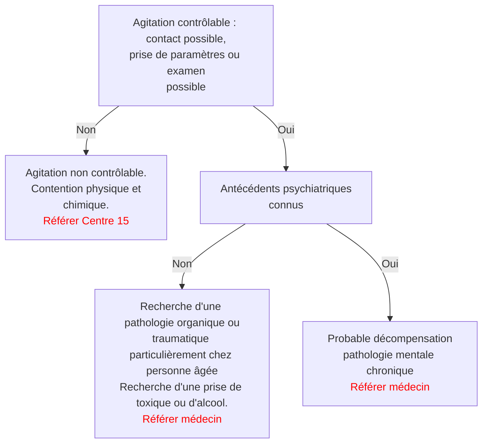

DIRECTION
DE LA SANTÉ

# GUIDE DES PROTOCOLES

**A l'usage des Professionnels de Santé
exerçant en Poste Isolé
en Polynésie Française**

COLLÈGE MÉDICAL
DIRECTION
DE LA SANTÉ

---

Guide des Protocoles - 2025    7

# PÉDIATRIE

---

| | PÉDIATRIE | Version : 2 |
|---|---|---|
| | **Diarrhée** | Validation : COTEPRO |
| | | Date : 2025 |

## CE QU'IL FAUT SAVOIR

• La diarrhée est la plupart du temps la conséquence d'une infection virale du tube digestif. On parle de gastro-entérite pouvant donc donner une diarrhée et des vomissements.

• La transmission se fait par voie oro-fécale, et la contagiosité peut être très élevée.

• La guérison infectieuse est la plupart du temps spontanée en quelques jours. Il n'existe aucun traitement agissant directement sur les virus responsables de GEA.

• Seules quelques rares diarrhées sont d'origine bactérienne nécessitant éventuellement une antibiothérapie. Les selles sont alors souvent glaireuses et/ou sanglantes. Les autres couleurs de selle (verdâtre, jaunâtre …) n'ont aucune significationparticulière.

• La gravité est liée à la déshydratation secondaire à l'hypersécrétion intestinale et aux vomissements.

• La déshydratation peut tuer par choc hypovolémique, c'est le cas pour plusieurs enfants chaque année en Polynésie.

• La perte de poids est classiquement utilisée pour évaluer la déshydratation. Mais un poids récent de comparaison est rarement disponible, et il peut exister une déshydratation importante sans perte de poids (notion de 3°secteur : eau en dehors du système vasculaire, mais toujours dans le corps : œdèmes, épanchement abdominal oupleural, diarrhée non extériorisée …)

• La déshydratation s'évalue à l'aide d'un ensemble de signes cliniques et de paramètres.

## CE QU'IL FAUT FAIRE

• Evaluer la présence et la gravité de la déshydratation, peser l'enfant nu systématiquement à chaque consultation

• Traiter la déshydratation et surveiller l'enfant en fonction de la gravité de la situation, proposer aux parents des objectifs horaires chiffrés d'hydratation selon le poids de l'enfant. (ex : bébé de 11kg – besoin de 1100ml/24h soit 45 ml/h ou 1 mesure et demi du biberon en moyenne).

• Ne pas arrêter le lait et réintroduire l'alimentation solide rapidement dès que l'enfant le peut

• Lutter contre la transmission oro-fécale dans les familles et les écoles.

## CE QU'IL NE FAUT PAS FAIRE

• Proposer des boissons type Coca Cola ou jus du magasin. Ces boissons sont inappropriées, et susceptibles d'aggraver la diarrhée.

• Proposer d'autres médicaments que les sels de réhydratations orales (SRO). Ils ne sont pas nécessaires voire dangereux. Les « anti-diarrhéiques » ne préviennent et ne traitent pas la déshydratation. Ils peuvent induire en erreur en masquant la diarrhée sans empêcher la déshydratation intra-intestinale. Les antiémétiques présentent un risque d'effets secondaires cardiaques et neurologiques graves.

• Arrêter le lait, mettre l'enfant à jeun, cela risque de rajouter une dénutrition à la déshydratation.

## CE QU'IL FAUT EXPLIQUER

• La diarrhée est le plus souvent due à un virus, qui ne nécessite pas de traitement spécfique.

• En attendant la guérison, le corps perd son eau et des sels minéraux régulièrement. Si cette eau et ces sels ne sont pas remplacés, le corps se vide de liquide et la pression dans les vaisseaux sanguins n'est plus suffisante pour assurer la circulation du sang. Le cœur peut alors s'arrêter.

• Eviter le décès d'un enfant présentant une gastroentérite consiste à remplacer par la bouche ou par les veines, l'eau et les sels minéraux perdus.

• C'est une maladie contagieuse transmise par les mains souillées par les selles, portées ensuite à la bouche. Le lavage des mains, l'isolement des couches dans un sac plastique, et l'utilisation correcte de cabinets aux normes, permettent de limiter la contagion.

Guide des Protocoles - 2025     8

---

| | PÉDIATRIE | Version : 2 |
|---|---|---|
| | **Toux** | Validation : COTEPRO |
| | | Date : 2025 |

## CE QU'IL FAUT SAVOIR

• Une toux semblant isolée est parfois le symptôme d'une pathologie grave (pneumopathie bactérienne, tuberculose, pneumothorax, laryngite grave, corps étranger, asthme débutant, allergie sévère). Mais, dans l'immense majorité des cas, les toux liées à une pathologie grave s'accompagnent de gêne respiratoire nette (dyspnée).

• Penser à la tuberculose devant une toux qui dure depuis plusieurs semaines, surtout avec une altération de l'état général. Se renseigner sur d'éventuels sujets contacts, faire alors un IDR et une radio au moindre doute (mais de toute façon une toux de 3 semaines d'origine bronchique doit avoir une radio de thorax).

## CE QU'IL FAUT FAIRE

Chercher des signes de gravité :

• Cyanose, polypnée, apnée, sueurs, difficultés à s'alimenter, à parler, faible réactivité, fatigue, âge <6mois, conditions socio-économiques défavorables.

Garder en observation tout enfant présentant des signes de gravité et référer au médecin voire appel au SAMU

Apprécier l'état général de l'enfant, prendre sa température mesurer FR, FC et SpO2.

Demander depuis combien de temps l'enfant tousse :

• Si cela vient d'arriver de manière brutale c'est peut-être un corps étranger inhalé.

• Si cela dure depuis une semaine, il s'agit peut-être d'une pneumopathie.

• Si cela dure depuis plus de trois semaines - penser à la tuberculose.

Ecouter, regarder l'enfant tousser et respirer :

• Si la toux est rauque avec un cornage (bruit inspiratoire comme un «i» prononcé en inspiration) il s'agit d'un problème haut situé : laryngite ou corps étranger.

• Si l'enfant siffle en respirant et que l'expiration est difficile, il s'agit d'un problème au niveau des petites bronches : asthme ou bronchiolite.

• Si l'enfant fait «du bruit» aux 2 temps respiratoires, il s'agit d'un problème rhino-pharyngé ou bronchique.

Ausculter les poumons :

• Faire tousser et moucher l'enfant avant l'auscultation permet de dégager les bronches et le rhino-pharynx et d'éliminer ainsi des bruits parasites gênant l'auscultation.

• Un «bruit» à l'inspiration dans un seul poumon est en faveur d'une pneumopathie, c'est en général des crépitants.

• Des sibilants (sifflements) expiratoires sont en faveur d'un asthme ou d'une bronchiolite.

• Des «bruits» aux deux temps respiratoires à type de ronflement sont en faveur de bruits transmis depuis le rhino-pharynx encombré ou d'une bronchite.

Compléter l'examen par un examen ORL et une auscultation cardiaque

Guide des Protocoles - 2025

---

Guide des Protocoles - 2025

---

# PÉDIATRIE
# Difficultés respiratoires

**Version : 2**  
**Validation : COTEPRO**  
**Date : 2025**

## CE QU'IL FAUT SAVOIR

• Prendre en charge un enfant présentant une difficulté respiratoire, nécessite du calme, de la patience et un bon sens de l'observation. Dans la majorité des cas, regarder et écouter (même sans stéthoscope) un enfant respirer permet de poser une hypothèse diagnostique correcte.

• Evaluer le score de Silverman : la détresse respiratoire est importante si le score >3

• La respiration du thorax et de l'abdomen est normalement synchrone. Quand le thorax se gonfle l'abdomen se soulève.

• Les signes apparaissent quasiment toujours dans le même ordre : battement des ailes du nez, puis tirage, geignement expiratoire, entonnoir xiphoïdien, puis balancement thoraco-abdominal (le thorax se soulève et l'abdomen s'abaisse), cela correspond à un épuisement du diaphragme qui est le muscle respiratoire principal. La situation est alors grave.

| Critères                      | 0                     | 1               | 2                          |
| ----------------------------- | --------------------- | --------------- | -------------------------- |
| Battement des ailes du nez    | absent                | modéré          | intense                    |
| Tirage                        | absent                | intercostal     | intercostal et sus-sternal |
| Geignement expiratoire        | absent                | au stéthoscope  | à l'oreille                |
| Entonnoir xiphoïdien          | absent                | modéré          | intense                    |
| Balancement thoraco-abdominal | respiration synchrone | thorax immobile | respiration paradoxale     |

• L'observation et l'écoute doivent permettre de déterminer si la gêne respiratoire est plutôt inspiratoire, plutôt expiratoire ou aux deux temps.

## CE QU'IL FAUT FAIRE

• Observer et écouter l'enfant assis sur les genoux d'un parent

• Un enfant dyspnéique est angoissé, ses parents aussi. Aussi, bien examiner l'enfant nécessite un minimum de mise en condition :

• Un seul parent présent (le plus calme) ;

• Enfant en position demi assis ou au mieux assis sur les genoux de l'adulte ;

• Soignant calme assis devant l'enfant, observant et écoutant celui ci.

• En dehors d'une situation d'urgence manifeste, les activités « agressives », viendront après (stéthoscope, thermomètre, saturomètre, masque à oxygène….).

Guide des Protocoles - 2025

---

Guide des Protocoles - 2025

---

# RECOMMANDATIONS THERAPEUTIQUES

## Corticothérapie générale pour une laryngite ou un asthme de l'enfant :

• **BETAMETHASONE 0.05% SOL BUV EN GOUTTES** 10 à 20 gttes par kg/j ;

• **CORTANCYL** 1 à 2 mg/kg/j

• Les corticoïdes sont prescrits en une dose par 24h, plutôt le matin en raison des effets excitants souvent rencontrés ;

• L'utilisation de corticoïdes sur des périodes brèves de 1 à 5j ne nécessite pas de décroissance progressive des doses.

## Aérosols :

• Placer la dose de médicament complétée par du sérum physiologique pour faire un total de 4 à 5 ml, dans un dispositif de nébulisation avec un débit de 6l/mn d'oxygène ou d'air

• **. ADRENALINE :** 1mg/ml sans conservateur +/- complété de 4 ml de sérum physiologique qsp 5ml à renouveler si nécessaire

• **. VENTOLINE :**

Enfant <16 kg : Salbutamol unidose 2,5mg/2.5 ml et +/- compléter avec 2,5ml de sérum physiologique

Enfant >16 kg : Salbutamol unidose 5mg/2.5 ml et +/- compléter avec 2,5ml de sérum physiologique

Dans l'asthme aigüe grave chez l'enfant de plus de 2 ans, il est possible de rajouter de l'Ipratropium 0,25mg à la 1ère nébulisation puis à la 3ème de salbutamol – max 3x/j.

* Tout enfant présentant des symptômes d'asthme une à plusieurs fois par semaine ou plus de deux fois par mois la nuit doit bénéficier d'un traitement préventif au long cours

* Demander éventuellement un avis au pédiatre ou au pneumologue.

Guide des Protocoles - 2025

---

| | PÉDIATRIE | Version : 2 |
|---|---|---|
| [LOGO] | **Douleur abdominale** | Validation : COTEPRO |
| | | Date : 2025 |

## CE QU'IL FAUT SAVOIR

• Les causes de douleurs abdominales chez l'enfant sont nombreuses, presque toutes les pathologies digestives et extra digestives peuvent se manifester par ce symptôme.

• L'âge de l'enfant peut orienter vers un diagnostic car certaines pathologies se rencontrent plus volontiers sur certaines tranches d'âge.

• Une des premières choses à faire devant un ventre douloureux est de calmer la douleur, le temps que le traitement agisse vous aurez le temps de récolter les symptômes.

• La douleur abdominale chez le malade polynésien est souvent perçue comme très angoissante car le ventre a une importance culturelle bien particulière. Aussi, l'analyse de la douleur est parfois difficile.

## RECOMMANDATIONS

• Le recueil des antécédents médico-chirurgicaux et l'examen systématique des autres systèmes sont indispensables : douleur abdominale et pneumopathie par exemple, prématurité et entérocolite ulcéro nécrosante…

• Chez la fille, même prépubère, l'anamnèse gynécologique ne doit pas être négligée.

• Le toucher rectal n'est habituellement pas nécessaire ni recommandé chez l'enfant.

## CE QU'IL NE FAUT PAS FAIRE

• Conclure trop vite à une constipation.

• Conclure trop vite à une somatisation.

• Ne pas examiner complètement l'enfant notamment les orifices herniaires et les organes génitaux externes chez le garçon et la fille en âge d'être pubère.

## CE QU'IL FAUT FAIRE

• Préciser la chronologie de la douleur. Un début aigu orientera vers avec un phénomène accidentel (traumatisme, invagination…), un début progressif vers un processus infectieux.

• Déterminer s'il s'agit d'une douleur continue ou d'une douleur intermittente (en colique). Une douleur en colique est liée à l'activité péristaltique et traduit une activité augmentée ou la lutte contre un obstacle.

• Après avoir calmé le malade, demandez-lui de plier les genoux pour décontracter les abdominaux, et de respirer doucement.

• Réchauffez vos mains, et commencez à palper doucement en débutant toujours par un secteur non douloureux, puis secteur par secteur.

Guide des Protocoles - 2025

---

# ORIENTATION DIAGNOSTIQUE DES DOULEURS ABDOMINALES EN FONCTION DE L'AGE

## À tout âge

| Symptômes associés aux douleurs abdominales                                                                                                                                                                                                                                                                                                                                                                                                         | Diagnostic                                                 | Prise en charge                                                                                                                                                                                                                                                                                                                                                                                                                                                                                                         |
| --------------------------------------------------------------------------------------------------------------------------------------------------------------------------------------------------------------------------------------------------------------------------------------------------------------------------------------------------------------------------------------------------------------------------------------------------- | ---------------------------------------------------------- | ----------------------------------------------------------------------------------------------------------------------------------------------------------------------------------------------------------------------------------------------------------------------------------------------------------------------------------------------------------------------------------------------------------------------------------------------------------------------------------------------------------------------- |
| Diarrhées, vomissements, fièvre                                                                                                                                                                                                                                                                                                                                                                                                                     | Gastro entérite aigue                                      | Virale la plupart du temps. Cf protocole diarrhées. Prévenir le risque de déshydratation.  En cas de selle glairosanglante, de signes de déshydratation ou de diarrhées > 2 semaines, avis médical                                                                                                                                                                                                                                                                                                          |
| Absence de selle ou selles dures, volumineuses et d'émission douloureuse.  Absence de fièvre, de vomissement.  L'allaitement maternel est l'équivalent d'un régime sans résidu. Les selles peuvent être rares (1/5 à 7 jours quelquefois), l'enfant n'est pas douloureux et ne vomit pas. Aucun traitement n'est nécessaire.  Eliminer des fissures anales douloureuses lors de la défécation qui aggravent la constipation | constipation                                               | Rééquilibrer le régime alimentaire (fibres)  Faire boire beaucoup d'eau (pas de soda)  Remettre en place une routine : l'enfant doit se présenter de façon quotidienne aux toilettes, après un repas, dans de bonnes conditions (réducteur de lunette, pieds en appui...) et en prenant son temps  Laxatif type NORMACOL enfant ou MICROLAX en cas de crise douloureuse, sinon préférer aux suppositoires de glycérine un macrogol per os type FORLAX 4g 1 à 4 sachets par jour pendant 3 mois. |
| Brûlures mictionnelles, pollakiurie, dysurie, urines malodorantes, fièvre, BU + (leucocytes, nitrites, sang)  Douleurs lombaires                                                                                                                                                                                                                                                                                                            | Infection urinaire                                         | Si fièvre : pyélonéphrite allo médecin  En l'absence de fièvre, cystite traitement probabiliste par AUGMENTIN dose poids x 3 par jour (en attendant ECBU si réalisable) et à réévaluer au bout de 2 à 3 jours                                                                                                                                                                                                                                                                                                   |
| Douleur intense d'un flanc lombaire irradiant la fosse iliaque  Pas de fièvre  BU normale ou sang                                                                                                                                                                                                                                                                                                                                   | Lithiase urinaire Syndrome de jonction pyélocalicielle | Antalgiques niveau II à III  Apports hydriques  Anti-inflammatoire non stéroïdien si besoin  Surveiller l'apparition de fièvre signant une pyélonéphrite sur obstacle                                                                                                                                                                                                                                                                                                                           |
| Anamnèse évocatrice. Douleur et/ou défense localisée orientera sur l'organe traumatisé. BU à la recherche d'hématurie                                                                                                                                                                                                                                                                                                                               | Traumatisme                                                | Avis spécialisé                                                                                                                                                                                                                                                                                                                                                                                                                                                                                                         |
| Douleur abdominale en fosse iliaque droite ou périombilicale fébrile sans contracture, souvent associée à un épisode infectieux ORL (rhinopharyngite aigue, angine)                                                                                                                                                                                                                                                                                 | Adénolymphie mésentérique                                  | Traitement symptomatique et antalgique. Surveillance évolutive à H24 pour écarter une appendicite aigue                                                                                                                                                                                                                                                                                                                                                                                                                 |

Guide des Protocoles - 2025

---

Guide des Protocoles - 2025

# Nourrissons

| Symptômes associés aux douleurs abdominales                                                                                                                                                                     | Diagnostic                                               | Prise en charge                                                                                                                                                                                                                                                      |
| --------------------------------------------------------------------------------------------------------------------------------------------------------------------------------------------------------------- | -------------------------------------------------------- | -------------------------------------------------------------------------------------------------------------------------------------------------------------------------------------------------------------------------------------------------------------------- |
| Souvent entre 1 et 4 mois  Pleurs, émissions de gaz soulageant les pleurs  Etat général conservé  Absence de modification des selles  Absence d'infléchissement staturopondéral | **Coliques du nourrisson**                               | Rassurer  Massages abdominaux  Portage  Eviter la suralimentation qui aggrave les douleurs  Prévenir le risque de syndrome du bébé secoué si les pleurs sont fréquents et prolongés                                                  |
| Entre 2 mois et 3 ans  Douleurs abdominales spasmodiques  Vomissements bilieux  Malaises, troubles de conscience ou du tonus  Rectorragies  Masse abdominale            | **Invagination intestinale aigue**  **Volvulus** | **Allo médecin, prise en charge médico chirurgicale urgente.** Laisser à jeun                                                                                                                                                                                        |
| Pleurs,  Vomissements  Masse inguinale non réductible plus souvent à droite  Plus fréquent chez l'enfant de petit poids de naissance et né prématurément                                | **Hernie inguinale engouée ou étranglée**                | Essayer de réintroduire l'anse digestive extériorisée en massant doucement dans le sens antéropostérieur et du bas vers le haut, après antalgie (paracetamol, tétée de solution sucrée type G30 %), **prise en charge chirurgicale urgente si réduction impossible** |

---

2 à 11 ans

| Symptômes associés aux douleurs abdominales                                                                                                                                         | Diagnostic              | Prise en charge                                                                                                                                                                                                                                                                                                                                                                                                                                                                                                                                                                                                                     |
| ----------------------------------------------------------------------------------------------------------------------------------------------------------------------------------- | ----------------------- | ----------------------------------------------------------------------------------------------------------------------------------------------------------------------------------------------------------------------------------------------------------------------------------------------------------------------------------------------------------------------------------------------------------------------------------------------------------------------------------------------------------------------------------------------------------------------------------------------------------------------------------- |
| Age >4ans, fièvre modérée douleurs en fosse iliaque droite (quelquefois hypogastriques) avec défense. Psoïtis. Petit fébricule. Langue saburrhale.                                  | Appendicite             | **Allo médecin**, traitement chirurgical. Laisser à jeun                                                                                                                                                                                                                                                                                                                                                                                                                                                                                                                                                                            |
| Fièvre, asthénie, toux, polypnée, crépitants, désaturation, douleurs hypocondres.                                                                                                   | Pneumopathie            | Antibiothérapie cf protocole toux                                                                                                                                                                                                                                                                                                                                                                                                                                                                                                                                                                                                   |
| Douleurs abdominales sans défense, absence de fièvre, purpura déclive, arthralgies-arthrites déclives.  Episode de rhinopharyngite dans les 3 semaines précédent l'épisode. | Purpura rhumatoïde      | Avis médical  Mesurer TA (HTA ?)  Faire BU (protéinurie, hématurie ?)  Traitement antalgique symptomatique palier 1 à 2  Risque de complications rénales, digestives, d'orchite.                                                                                                                                                                                                                                                                                                                                                                                                                    |
| Crampes abdominales sans fièvre, ni diarrhée ni vomissement. Ballonnement, gaz.                                                                                                     | Douleurs fonctionnelles | Vérifier l'absence de signe de gravité, traiter par antispasmodiques et/ou antalgiques.  En cas de diarrhée avec déshydratation, les SRO peuvent être utilisés chez l'adulte.  Ne pas hésiter à donner des antiparasitaires : dans ce cas, prélever une parasitologie des selles ET traiter sans attendre :  > **flubendazole** : 1 cp ou 1 cuillère à café en 1 seule prise à renouveler 15 jours après (oxyurose), pour les autres parasites : 1 cp ou 1 cuillère à café matin et soir pendant 3 jours  > **albendazole** (pédiatrique) : 7.5 mg/kg matin et soir par jour sans dépasser 800 mg/j |

Guide des Protocoles - 2025

---

11 ans à 18 ans

| Symptômes associés aux douleurs abdominales                                                                             | Diagnostic                              | Prise en charge                                                                                                                     |
| ----------------------------------------------------------------------------------------------------------------------- | --------------------------------------- | ----------------------------------------------------------------------------------------------------------------------------------- |
| Douleurs abdominales +/- fébriles récurrentes Diarrhées glairosanglantes Asthénie, perte de poids               | Maladie inflammatoire du tube digestif  | Avis spécialisé                                                                                                                     |
| Garçon, douleurs intenses, nausées, prostration, ascension testiculaire, abolition du réflexe crémastérien              | Torsion testiculaire                    | Urgence chirurgicale Avis SAMU                                                                                                      |
| Test de grossesse négatif Douleurs pelviennes, absence de défense                                                   | Dysménorrhées, douleurs menstruelles    | Antalgiques palier 1 à 2 Calendrier menstruel à tenir Surveiller le risque d'anémie si saignement prolongé Avis medical |
| Douleurs pelviennes ou fosses iliaques, défense Retard de règle Test de grossesse positif, Métrorragies | GEU                                     | Urgence gynécologique Appel SAMU                                                                                                |
| Douleurs intenses pelviennes et/ou Fosses illiaques défense, ou contracture nausées                             | Torsion d'ovaire, torsion d'annexes | Urgence chirurgicale, avis SAMU                                                                                                     |
| Douleurs pelviennes Masse pelvienne Début de puberté Absence d'orifice vulvaire                             | Hematocolpos                            | Avis SAMU, prise en charge chirurgicale                                                                                             |

Guide des Protocoles - 2025

---

| | PÉDIATRIE | Version : 2 |
|---|---|---|
| | **Fièvre** | Validation : COTEPRO |
| | | Date : 2025 |

## CE QU'IL FAUT SAVOIR

• La fièvre est définie par une température rectale supérieure ou égale à 38°C. La température peut être mesurée en axillaire, la mesure doit être majorée de 0.5°C.

• La mesure auriculaire avec un thermomètre auriculaire n'est pas validée pour les enfants de moins de 2 ans.

• La fièvre n'est pas dangereuse en elle-même en dessous de 40,5°C, c'est la maladie sous jacente qui peut être dangereuse.

• Les convulsions fébriles simples sont définies par :

• --> âge de survenue entre 6 mois et 5 ans

• --> épisode bref (moins de 15 minutes)

• --> bilatérale et symétrique

• --> tonico-clonique

• --> sans déficit neurologique transitoire ou permanent

• Elles n'ont pas de retentissement sur le développement de l'enfant. Elles peuvent se répéter dans le temps. Si leur durée excède 5 minutes un traitement par VALIUM intra rectal 0,5 mg/kg peut être administré. Un avis médical sera nécessaire. Sont qualifiées de convulsions atypiques (ou complexes) si elles sont focales, prolongées, ou récidivent plus d'une fois en 24 heures. Elles nécessiteront alors un avis médical.

• Toute fièvre chez le nourrisson de moins de 4 mois nécessite un avis médical car il peut s'agir d'une infection néonatale tardive à streptocoque B, Escherichia coli, listeria.

• Avant 1 mois, un bilan et une surveillance en milieu spécialisé sont toujours nécessaires.

• Toute fièvre durant depuis plus de 5 jours n'est pas banale et nécessite un avis médical.

## CE QU'IL NE FAUT PAS FAIRE

• Prescrire des antibiotiques sans raison devant une fièvre. Les antibiotiques ne sont pas des antipyrétiques, ils n'agissent que sur les infections supposées bactériennes et nonvirales.

• Proposer un bain pour refroidir l'enfant. Risque de convulsion lié à la baisse rapide de la température

## TRAITEMENT SYMPTOMATIQUE IMMEDIAT

• Hydrater, déshabiller, linges humides dans le cou, sous la couche, pièce ventilée, ou ventilateur.

• Traiter avec du **PARACETAMOL**, antipyrétique de première intention recommandée en Polynésie française en cas de fièvre mal supportée.

  • Dose quotidienne recommandée est de 60 mg/kg/j, à répartir en 4 ou 6 prises (soit environ 15mg/kg toutes les 6 heures ou 10 mg/kg/j toutes les 4 heures).

  • Posologie maximale est de 80 mg/kg/j chez l'enfant de moins de 37 kg, et 3g/j pour l'enfant de plus de 37 kg.

Guide des Protocoles - 2025

---

# TRAITEMENT A ENVISAGER SELON LES SIGNES MAJEURS

| Signes majeurs                                                                                         | Symptômes et facteurs de risque                                                                                                                                                                                                                                                   | Diagnostic et prise en charge                                                                                                                                                                |
| ------------------------------------------------------------------------------------------------------ | --------------------------------------------------------------------------------------------------------------------------------------------------------------------------------------------------------------------------------------------------------------------------------- | -------------------------------------------------------------------------------------------------------------------------------------------------------------------------------------------- |
| Fièvre chez un enfant de moins de 4 mois                                                               | Age < 1 mois : bilan sanguin, urinaire et ponction lombaire  Age 1 à 4 mois : BU+/- ECBU                                                                                                                                                                                  | Avis médical                                                                                                                                                                                 |
| Fièvre avec : altération de la conscience, malade prostré, enfant geignard ou peu réactif      | Raideur de nuque, signe de Kernig (les genoux se plient quand on tente de fléchir la tête), céphalées, crainte de la lumière, vomissements. Fontanelle bombante chez le nourrisson                                                                                            | - Infection neuro-méningée **Référer SAMU**                                                                                                                                              |
| Fièvre mal supportée                                                                                   | Un ou plusieurs des symptômes : • Polypnée, cyanose, tirage, marbrures, • froideur des extrémités, • Purpura • Pouls rapide difficile à prendre, • TA basse, • Troubles de conscience, • Purupra • Purpura • Douleur abdominale, • Ictère | Sepsis / Choc infectieux Infection pulmonaire sévère Infection abdominale chirurgicale  **Référer SAMU**                                                                     |
| Fièvre avec **purpura ou saignement**                                                                  | Saignement extériorisé : nasal, buccal, digestif, intestinal, urinaire, pulmonaire.... Saignement sous cutané : pétéchies, ecchymoses.                                                                                                                                        | Infection neuro-méningée Dengue, leptospirose  **Référer SAMU**                                                                                                                  |
| Fièvre bien supportée avec présence d'un symptôme d'appel permettant une orientation diagnostique      | Rhinorrhée, otalgie, otorrhée, toux, expectoration, douleur thoracique, dyspnée modérée. Plaie, hématome ou autre lésion cutanée infectée, abcès, dermo-hypodermite. Trouble mictionnel, douleur lombaire Diarrhée, vomissements                                      | Infection des voies aériennes supérieures ou inférieures  Infection cutanée ou sous cutané Infection urinaire Infection gastro-intestinale Cf: Protocoles correspondants |
| Fièvre ou syndrome grippal bien supporté sans symptôme d'appel permettant une orientation diagnostique |                                                                                                                                                                                                                                                                                   | **Référer Arbre décisionnel**                                                                                                                                                                |

## RECOMMANDATIONS

• Vérifier l'absence de signe de gravité évoquant un état de choc ou un état infectieux sévère, une infection neuro-méningée ;

• Surveiller l'évolution : si pas d'amélioration dans les 48h, il faut vérifier le traitement (indication, posologie, observance) et si celui est adapté, il faut revoir son diagnostic, et en référer au médecin.

Guide des Protocoles - 2025

---

Guide des Protocoles - 2025    25

# MÉDECINE ADULTE

---

|  | **MÉDECINE ADULTE**  **Agitation** | **Version : 2**  **Validation :** COTEPRO  **Date :** 2025 |
| --------- | ------------------------------------------ | -------------------------------------------------------------------------- |

## CE QU'IL FAUT SAVOIR

• L'état d'agitation est un trouble du comportement d'origine psychiatrique, toxique, traumatique ou somatique. L'agitation, qu'elle soit agressive ou non est parfois le résultat d'une angoisse importante.

• Le passage à l'acte violent est néanmoins toujours possible, aussi la base de la prise en charge reste la prudence et la protection du personnel et de la communauté. Il est nécéssaire de prendre en charge le patient dans un espace calme.

• En cas de trouble à l'ordre public et de dangerosité, le maire de la commune doit mettre en œuvre toutes les mesures provisoires nécessaires à la sécurité des biens et des personnes. Il établi ensuite si nécessaires un arrêté d'admission en soins psychiatriques basé sur le certificat médical établi à distance par le médecin référent. Si besoin, la sécurisation du patient et de l'accompagnement paramédical est assurée par la police municipale jusqu'au service de psychiatrie.

• la prise en charge d'une personne en état d'agitation dans une île est une situation particulièrement complexe. Aussi, les clés de la réussite sont la prévention (cette situation ne doit pas arriver) et l'anticipation (une réponse type à ce genre de situation doit être organisée et simulée à l'avance avec les autorités de l'île).

## CE QU'IL NE FAUT PAS FAIRE

• Essayer seul et sans préparation de maitriser physiquement un patient agité.

• Négliger la recherche d'une cause somatique, traumatique ou toxique.

• Limiter les visites à domicile au geste technique (injection IM neuroleptiqueretard).

• Attendre qu'une situation de crise apparaisse sur l'île, sans avoir essayé de la prévenir et sans avoir anticipé la réponse.

• Négliger de mettre à jour le stock de médicaments de l'agitation permettant de traiter un patient suffisamment longtemps jusqu'à son transfert à Tahiti.

## CE QU'IL FAUT FAIRE

• Assurer un suivi rigoureux des patients mentaux avec détection précoce de la décompensation par des visites à domicile régulière (au moins une fois par mois et à la demande de la famille, penser à questionner l'entourage sur le comportement du patient). Effectuer des actions de prévention du trouble d'usage de substance (alcool, tabac, cannabis, métamphétamines) notamment auprès des jeunes.

• Rassurer le patient, l'entourage et soi-même. Respecter le patient, lui parler calmement et correctement, c'est encore plus important que pour tout autre malade. Ne pas répondre aux « provocations » du patient.

• L'interrogatoire et la prise de paramètres sont obligatoires permettant d'éliminer les causes classiques d'agitation non psychiatrique : alcoolisation aigue, intoxication aigue, hypoglycémie, traumatisme crânien, infection du système nerveux central... L'examen clinique est recommandé dès que possible.

• **En cas de besoin de contention physique** : identifier cinq aides en plus du soignant. Le patient est saisi par quatre personnes (un par membre). Une cinquième personne saisit la tête dès que possible et la maintient sur le côté. Le patient est ensuite allongé sur le dos chaque membre maintenu par une personne. Des sangles spécialisées sont disponibles à la Pharmappro pour les contentions sur un lit ou brancard. Tête du lit est surélevée pour éviter les inhalations. Placer le patient dans une pièce prévue à cet effet, calme, protégé. Surveillance active indispensable

Guide des Protocoles - 2025

---

ARBRE DECISONNEL

Guide des Protocoles - 2025

---

# TRAITEMENT A ENVISAGER SELON LA SITUATION TYPE

| Situation                                                           | Traitement non médicamenteux                                      | Traitement médicamenteux                                                                                                                                                                              | Remarques                                                                                                                                                                                                                                                                                                                                                                                                                                                            |
| ------------------------------------------------------------------- | ----------------------------------------------------------------- | ----------------------------------------------------------------------------------------------------------------------------------------------------------------------------------------------------- | -------------------------------------------------------------------------------------------------------------------------------------------------------------------------------------------------------------------------------------------------------------------------------------------------------------------------------------------------------------------------------------------------------------------------------------------------------------------- |
| Agitation non contrôlable                                           | Contention physique                                               | LOXAPINE (LOXAPAC®) 50 mg 1 à 2 amp IM Ou DIAZEPAM 10 à 20 mg IM                                                                                                                              | LOXAPINE si origine psychiatrique suspectée DIAZEPAM si autre origine                                                                                                                                                                                                                                                                                                                                                                                                |
| Agitation contrôlable sur probable décompensation mentale chronique | Qualité de l'approche relationnelle et rassurante pour le patient | LOXAPINE (LOXAPAC®) (25 à 100 mg PO Reprise du traitement habituel si rupture de traitement                                                                                                           | Si patient non coopérant : LOXAPINE IM comme ci-dessus                                                                                                                                                                                                                                                                                                                                                                                                               |
| Agitation contrôlable sans étiologie psychiatrique connue           | Qualité de l'approche relationnelle et rassurante pour le patient | DIAZEPAM (VALIUM ®)10mg jusqu'à 3 cp par jour  Si patient avec IHC : OXAZEPAM (SERESTA ®) 10mg x 2 et jusqu'à 150mg max  Si femme enceinte : OXAZEPAM 10mg (maximum 3 x/jour) | Si patient non coopérant : DIAZEPAM IM comme ci-dessus  Toujours rechercher la dose minimale efficace  Source CRAT : à 30mg jour, 1% de la dose maternelle est reçu par l'enfant. A ce jour, il n'a pas été rapporté d'effet particulier chez des enfants allaités par des mères sous oxazépam. Au vu de ces éléments, l'utilisation de l'oxazépam est possible chez une femme qui allaite, si possible dans la limite de 10 mg trois fois par jour. |

Guide des Protocoles - 2025

---

| | MÉDECINE ADULTE | Version : 2 |
|---|---|---|
| | **Brûlure de méduse** | Validation : COTEPRO |
| | | Date : 2025 |

## CE QU'IL FAUT SAVOIR

Il existe des dizaines de sortes de méduse allant de la méduse inoffensive à celle potentiellement mortelle en quelques minutes. En Polynésie, les méduses rencontrées sont le plus souvent responsables de réactions modérées.

Les méduses possèdent des filaments recouverts de cellules urticantes (nématocystes) qui déchargent un venin dans la victime à l'aide d'un aiguillon lorsqu'elles sont touchées.

La symptomatologie des piqûres de méduse est presque exclusivement locale et cutanée :

• Une piqûre légère est immédiatement suivie d'une douleur vive, décrite comme une sensation de décharge électrique ou de brûlure. Cette douleur augmente pendant 30 à 40 minutes avec apparition deparesthésies.

• Dix minutes après la piqûre apparaît un érythème léger qui s'aggrave pendant les 4 heures suivantes avec développement d'une éruption rouge-marron ou violacée typiquement en forme de coup de fouet. Cet érythème permet d'évaluer la surface cutanée concernée.

• Les réactions générales de type vagales ainsi que les réactions allergiques sont peufréquentes.

• Les envenimations sévères (rares en Polynésie) s'accompagnent d'une réaction cutanée typique ainsi que d'une cohorte de symptômes généraux qui apparaissent en 2 à 4 heures : céphalées, léthargie, vertige, ataxie, syncope, convulsions, coma, vomissements, dysphagie, spasmes musculaires, paralysies, choc anaphylactique, hémolyse, hématurie, insuffisance rénale, troubles du rythme, conjonctivite, ulcère de cornée, bronchospasme, insuffisance respiratoire et décès.

## CE QU'IL NE FAUT PAS FAIRE

• Inciser la lésion, chercher à la faire saigner et la sucer pour aspirer le venin

• Laisser le patient se gratter (ceci aggraverait la symptomatologie en permettant l'éclatement de la totalité des nématocystes encore présents sur la peau).

## CE QU'IL FAUT FAIRE

• Retirer les filaments visibles avec une pince ou à la main doublement gantée, puis appliquer de la mousse à raser. Racler délicatement la mousse contenant les nématocystes ainsi piégés à l'aide d'une abaisse langue.

• Rincer abondamment la piqûre à l'eau de mer ou au sérum physiologique. La toxine étant thermolabile, l'eau peut être chaude sans brûler. Le rinçage dure jusqu'à disparition des symptômes (environ 30 minutes). L'eau douce fait eclater les nématocytes.

• Après décontamination, la plaie sera séchée puis enduite d'anesthésiques locaux ou de corticoïdes de classe moyenne ou faible (Locapred) dont les effets bénéfiques ont été démontrés principalement devant la persistance des lésions après 24 heures.

• Vérifier et éventuellement remettre à jour la vaccination antitétanique (c.f. Protocole).

• Les lésions ulcérées seront nettoyées quotidiennement et recouvertes d'une fine couche de lotion antiseptique non allergisante (chlorhexidine aqueuse 0.2%).

Guide des Protocoles - 2025

---

Guide des Protocoles - 2025                                                                                                                                    30

• Les traitements antalgiques de palier I à II, rarement III sont indiqués (échelle thérapeutique de la douleur selon l'OMS).

• Toujours anticiper une réaction anaphylactique et donc être préparé à y répondre par les antihistaminiques et les corticoïdes par voie veineuse.

• A compléter en cas de choc par remplissage veineux avec du chlorure de sodium ou macromolécules ; oxygène et Adrénaline IM ou SC (0,25mg chez l'enfant et 0,5mg chez l'adulte, à répéter si besoin tous les 15mn.

---

|  | **MÉDECINE ADULTE** | **Version : 2** |
|---|---|---|
|  | **Coups et blessures, violences sexuelles** | **Validation : COTEPRO** **Date : 2025** |

## CE QU'IL FAUT SAVOIR

• L'Unité Médico-Judiciaire (UMJ) du CHPF a mis en place une astreinte de médecins légistes, joignable aux heures ouvrables au : 40 48 60 95 et aux heures non ouvrables au : 87 36 66 29. Elle est disponible pour répondre à toute question d'ordre médico-légal.

• UAPed

• Un examen pour violences est un acte important qui peut donner lieu à la rédaction d'un certificat médical pour la justice.

• Ce certificat a un rôle majeur, de celui-ci dépend en partie la réparation judiciaire des blessures. Cette réparation contribue au soulagement des séquelles physiques et psychiques de la victime.

• Le certificat médical initial (CMI) a par la suite un rôle important. Normalement effectué par un médecin, ce certificat doit être effectué à distance par le médecin référent sur la base de données et d'informations transmises par l'infirmier. Ce dernier peut éventuellement être réquisitionné par la justice pour transmettre des informations à celle-ci, sous la forme d'une attestation de santé. Dans ce cas, cela doit être effectué en collaboration avec la hiérarchie : médecin référent, cadre de santé ou subdivisionnaire.

• L'Incapacité Totale de Travail (ITT) ne peut être définie que par un médecin, et idéalement un médecin légiste. Elle ne doit pas être mentionnée sur les attestations de santé.

• En cas de suspicion d'agression sexuelle, l'examen génital sera fait sur réquisition à l'UMJ. Seul un professionnel de santé formé pourra réaliser les examens adéquats pour la recherche de lésions internes (par vidéo-colposcopie).

• Les plaintes des victimes peuvent être déposées dans n'importe quel établissement des forces de l'ordre. Les plaintes peuvent être déposées sans CMI.

## CE QU'IL FAUT FAIRE

• Calmer l'entourage, rester calme.

• Prendre en charge la détresse psychologique de la victime. Cette détresse doit être également décrite dans le certificat.

• Calmer la victime par vos paroles et/ou à l'aide d'un anxiolytique

• Rester neutre, ne pas s'engager dans le conflit potentiel existant dans votre communauté.

• Si possible, faire des photographies des séquelles physiques de la victime et les laisser dans son dossier. Les photographies peuvent être faites avec un appareil personnel, après accord du patient, puis transférées dans le dossier du patient et supprimées de l'appareil photo personnel (si possible en présence du patient).

## COMMENT TRANSMETTRE DES INFORMATIONS

• Décrire ce qui est constaté, ne pas s'avancer sur les causes et l'origine des traumatismes.

• Utiliser le conditionnel et décrire les lésions en termes simples.

• Dans le cas d'une réquisition écrire : « Attestation de santé établie sur réquisition de la gendarmerie et remis à celle-ci » (et ne pas se contenter d'une réquisition verbale, exiger un document de réquisition officiel).

• **Rendre compte au** médecin référent et lui envoyer un double de**l'attestation.**

Guide des Protocoles - 2025                                                                                                                                    33

---

**QUI ET COMMENT INFORMER EN CAS DE VIOLENCE ENVERS UN MINEUR OU UNE PERSONNE ADULTE VULNÉRABLE ?**

- Tous les professionnels de santé ont l'obligation d'informer le service social en cas de mineur ou majeur vulnérable (=personne porteuse de handicap, de pathologie psychiatrique, enceinte, âgée ou sous emprise) en risque de danger. Et en cas de maltraitance ou de danger avéré, ils se doivent d'informer les autorités judiciaires.

• S'il s'agit de suspicion de danger non avéré, réalisation d'une **information préoccupante**

• S'il s'agit de danger avéré non imminent (exemple : violences par le passé), réalisation d'un **signalement non urgent**

• S'il s'agit de danger avéré avec risque immédiat (exemple : vit dans la maison de son agresseur), réalisation d'un **signalement urgent**

- Cette information peut être complétée selon le formulaire destiné à tout professionnel joint ci-dessous. Sinon il peut être fait sur papier libre et doit comporter :

• L'état civil et le domicile de l'enfant,

• Un exposé de la situation,

• Tous les renseignements connus concernant l'environnement social, familial et scolaire de l'enfant,

• Un certificat médical selon les cas.

- Elle est transmise par mail et complétée par un appel téléphonique en cas d'urgence au substitut du procureur et à la DFSE selon la procédure détaillée page 4 ci-dessous.

- Envoyer ensuite une copie de l'information au médecin référent.

Guide des Protocoles - 2025

---

Guide des Protocoles - 2025## TRAITEMENT A ENVISAGER SELON LA SITUATION

| Situation type                                                                                                                             | Conduite à tenir                                                                                                                                                                                                                                                                                                                                                                                                                                                                                                                                                                                                                                                                                                                                                                                                                                                                                                                                                                                                                                                                                                                                                                                                                                                                    | Traitement                                                                                                                                                                                                                                                                                                                                                                             |
| ------------------------------------------------------------------------------------------------------------------------------------------ | ----------------------------------------------------------------------------------------------------------------------------------------------------------------------------------------------------------------------------------------------------------------------------------------------------------------------------------------------------------------------------------------------------------------------------------------------------------------------------------------------------------------------------------------------------------------------------------------------------------------------------------------------------------------------------------------------------------------------------------------------------------------------------------------------------------------------------------------------------------------------------------------------------------------------------------------------------------------------------------------------------------------------------------------------------------------------------------------------------------------------------------------------------------------------------------------------------------------------------------------------------------------------------------- | -------------------------------------------------------------------------------------------------------------------------------------------------------------------------------------------------------------------------------------------------------------------------------------------------------------------------------------------------------------------------------------- |
| **Adulte victime de coups et blessures sans violence sexuelle**  **Avis UMJ si besoin**                                            | Rassurer la victime. Examiner **l'ensemble du corps**, rechercher les traces de coups, des ecchymoses, des plaies, des fractures, des brûlures…, noter précisément ces éléments dans le dossier du patient pour la réalisation du CMI. Prélever une alcoolémie et les stupéfiants, si demandés par une réquisition de l'autorité judiciaire : - Si demande de prélèvements et que vous y êtes habilités : • 2 tubes verts pour les stupéfiants et 2 tubes gris pour l'alcoolémie, à séparer en 2 scellés contenant 1 tube de chaque                                                                                                                                                                                                                                                                                                                                                                                                                                                                                                                                                                                                                                                                                                                                 | Entreprendre une **relation d'aide**, et si angoisse ou stress important donner un **anxiolytique (OXAZEPAM 10 mg) PO**  **Calmer la douleur** **Traitement** des divers **traumatismes et plaies**                                                                                                                                                                        |
| **Adulte victime de violences sexuelles**  **Référer médecin**  **Avis UMJ recommandé**                                    | Rassurer la victime. Si désir de porter plainte, contacter les autorités judiciaires. Un document de **dépôt de plainte simplifié** a été mis au point, il peut être rempli et envoyé directement par mail aux autorités judiciaires. Cf document joint ci-dessous. **Si l'agression date de moins de 5 jours :** adresser systématiquement à l'UMJ qui effectuera l'examen et les prélèvements nécessaires. - Garder systématiquement les sous-vêtements dans une enveloppe craft (qui deviendra un scellé). - Si vous y êtes habilités, après avis, un prélèvement peut être fait par écouvillon sec pour les traces de sperme. **Si l'agression date de plus de 5 jours :** contacter l'UMJ de garde pour conseil et avis, - Si vous y êtes habilités, et après discussion avec le médecin légiste d'astreinte, un premier examen succinct peut être réalisé, notamment pour réaliser les prélèvements. - Si vous y êtes habilités, après accord du patient, les sérologies HIV, syphilis, hépatite B et hépatite C peuvent être prélevées. Les PCR IST sur prélèvement urinaire ou auto-prélèvement peuvent également être réalisées. - La bandelette urinaire sera faite sur orientation clinique de symptômes fonctionnels urinaires. | Entreprendre une **relation d'aide**, et si angoisse ou stress important donner un anxiolytique PO **Calmer la douleur** **Traitement** des divers **traumatismes et plaies** Proposer la **pilule du lendemain**. Efficacité maximale si 1°cp donné avant la 12°h après le rapport Si doute sur 1 risque de transmission de MST (VIH, hépatites), contacter l'UMJ |
| **Mineur victime de violences physiques, psychologiques ou sexuelles**  **Référer médecin Information judiciaire obligatoire** | Rassurer l'enfant ou le mineur, entretien et examen si possible santé en présence d'un représentant légal.  Si l'enfant est consentant, **inspecter visuellement** l'ensemble du corps puis contacter le médecin référent ou l'UAPED  Réaliser selon le degré d'urgence un signalement ou une information préoccupante  Si désir de porter plainte par les représentants légaux, contacter les autorités judiciaires. Un document de **dépôt de plainte simplifié** a été mis au point, il peut être rempli et envoyer directement par mail aux autorités judiciaires. Cf document joint ci-dessous.                                                                                                                                                                                                                                                                                                                                                                                                                                                                                                                                                                                                                                                    | **Entreprendre une relation d'aide**, et si angoisse ou stress important donner un anxiolytique PO à partir de 15 ans **Calmer** la douleur Traitement des divers traumatismes et plaies                                                                                                                                                                                       |

---

| | **MÉDECINE ADULTE** | **Version : 2** |
|---|---|---|
| | **Douleurs abdominales de l'adulte** | **Validation : COTEPRO** **Date : 2025** |

## CE QU'IL FAUT SAVOIR

• La douleur abdominale chez le malade polynésien est souvent perçue comme très angoissante car le ventre a une importance culturelle bien particulière. Aussi, l'analyse de la douleur est parfois difficile.

• Pour un bon examen il faut donc savoir calmer l'angoisse de l'entourage (les faire sortir gentiment), calmer l'angoisse du malade et parfois traiter rapidement la douleur avant de compléter l'examen.

• Les douleurs abdominales sont complexes car les origines sont nombreuses : digestives, urologiques, appareil reproducteur, obstétricales, thoracique (pulmonaires, cardiaques), etc.

## RECOMMANDATIONS

• La mise en place d'un traitement contre la douleur permet de la calmer et donne le temps de compléter l'examen (récolter des informations).

• Il faut savoir caractériser la douleur : intensité, localisation, irradiation, chronologie, durée ; ainsi que les signes qui accompagnent les douleurs abdominales : signes généraux (fièvre, hémodynamique, asthénie, etc.), signes fonctionnels urinaires (brûlures mictionnelles, pollakiurie, hématurie, etc.), signes fonctionnels digestifs (trouble du transit, vomissement, etc.), signes gynécologiques (ménométrorragie, leucorrhées anormales, etc.)

• Quand une femme en âge de procréer présente une douleur abdominale, ne jamais oublier de faire un test de grossesse même avec une contraception et quel que soit ce moyen de contraception. Le risque d'une grossesse extra-utérine (GEU) est toujours à considérer.

• Devant des douleurs abdominales épigastriques et chez un patient à FDRCV, il faut penser à l'infarctus et faire un ECG.

• Une bandelette urinaire (BU) peut être réalisée devant des douleurs abdominales et +/- la présence de symptômes urinaires. Une (BU) est positive si leucocytes (+ à +++) et/ou nitrites (+). La technique est importante et doit être maîtrisée (voir mode d'emploi). Une BU positive peut confirmer une infection urinaire en cas de symptômes urinaires. S'il s'agit infection urinaire compliquée, un ECBU est nécessaire.

## CE QU'IL FAUT FAIRE

• Pour examiner un ventre après avoir calmé la douleur, allonger le malade sur le dos, demandez-lui de plier les jambes pour décontracter les abdominaux, et de respirer doucement.

• Réchauffez vos mains, et commencez à palper doucement en débutant toujours par un secteur non douloureux, puis secteur par secteur.

• Examiner le ventre avec méthode : il peut être divisé en 9 quadrants, chaque quadrant pouvant correspondre à la localisation douloureuse d'un ou plusieurs organes :

Guide des Protocoles - 2025                                                                                                                                                    38

---

Guide des Protocoles - 2025    39

*Figure 1 : Localisation des quadrants abdominaux*

|  |   |   | **HD** : région de l'hypochondre gauche **E** : région épigastrique **HG** : région de l'hypochondre droit **FD** : région du flanc droit **O** : région ombilicale **FG** : région du flanc gauche **FID** : région de la fosse iliaque droite **H** : région hypogastrique **FID** : région de la fosse iliaque droite |
| ------------------------------------------------------------------------------------------------------------------------------- | - | - | -------------------------------------------------------------------------------------------------------------------------------------------------------------------------------------------------------------------------------------------------------------------------------------------------------------------------------------------------------- |

L'examen des flancs peut être complété par la percussion des fosses lombaires : une main à plat sur une fosse lombaire et l'autre main vient la percuter. Ce signe permet de voir s'il y a une inflammation ou irritation des loges rénales. Il est positif si la percussion est douloureuse.

**SAVOIR REPERER LES SIGNES EVOCATEURS DE SITUATION GRAVE :**

• Signes de choc : tachycardie, pouls filant, pâleur, marbrures, TA basse, etc.

• Défense ou une contracture : il s'agit d'une contraction réflexe des muscles abdominaux soit quand on palpe le ventre (défense), soit en permanence sans même palper(contracture).

• Un «arrêt des gaz et des matières » : signant l'occlusion intestinale, pas de selles depuis 48h, pas de gaz, à l'auscultation du ventre avec un stéthoscope pendant au moins deux minutes sans bruits perçus.

• Fièvre : signe pouvant évoquer une péritonite, une infection rénale grave. Peut également être présente en cas d'infection digestive telle que la gastro-entérite, ou toxi-infection alimentair

---

RECONNAITRE ET TRAITER EN DEHORS DES SIGNES DE GRAVITE

| Où ?                                                                    | Symptômes et signesExamens à faire                                                                                                            | Diagnos-tic(s) pos-sible(s)                                                     | CAT et traitement(s)                                                                                                                                                                                                                                                                                                                                                                           |
| ----------------------------------------------------------------------- | --------------------------------------------------------------------------------------------------------------------------------------------- | ------------------------------------------------------------------------------- | ---------------------------------------------------------------------------------------------------------------------------------------------------------------------------------------------------------------------------------------------------------------------------------------------------------------------------------------------------------------------------------------------- |
| Douleur épigastrique                                                    | Examen pulmonaire ECG à faire si facteurs de risques cardiovasculaires  Contexte possible de prise récente d'AINS         | Reflux gastro- œsophagiens, gastrite                                    | Antiacide (Moxydar) 3 fois par jour + un inhibiteur de la pompe à proton si nécessaire (Pantoprazole 20mg) pendant quelques jours. En cas de selles noirâtres, molles, avec odeurs nauséabondes (méléna) ou de vomissement sanglant (hématémèse) : **Référer médecin** Si les symptômes persistent ou ne sont pas soulagés par ce traitement : **Référer médecin** |
| Douleur brutale épigastrique irradiation vers épaule gauche | Examen pulmonaire ECG à faire si facteurs de risques cardiovasculaires Contexte possible d'alcoolisme                         | Pancréatite   Infarctus- Dissection aortique                | Les douleurs sont souvent intenses et transfixiantes (traversant l'abdomen). Le diagnostic se base sur les éléments clinques, biologique et radiologique. Si suspicion, **Référer médecin**                                                                                                                                                                                    |
| Douleur de l'hypochondre droit                                      | Examen pulmonaire ECG à faire si facteurs de risques cardiovasculaires                                                                | Calcul hépatique   Cholecystite                                     | Antispasmodique per os ou IV (Phloroglucinol) et antalgiques selon le niveau de douleurs Rester à jeun le temps que la douleur se calme Parfois l'obstruction des canaux biliaires peut s'infecter et donner alors en plus de la douleur une fièvre et un ictère : **Référer médecin**                                                                                     |
| Douleur d'un flanc                                                      | Fièvre Signes fonctionnels urinaires Nausée et vomissement possibles - Bandelette urinaire : leucocytes, sang et nitrites | Infection urinaire haute (IUH)   Colite pseudo- membraneuse | Prélever ECBU  IUH = **Référer médecin**                                                                                                                                                                                                                                                                                                                                               |
|                                                                         | Pas de fièvre Irradiation possible vers la fosse iliaque BU : leucocytes et sang                                                  | Lithiase (=calcul) urinaire                                                 | **Antalgiques** niveau II à III **Anti-inflammatoires** pendant quelques jours Apports hydriques libres Si pas d'amélioration : **Référer médecin**                                                                                                                                                                                                                                |

Guide des Protocoles - 2025

---

Guide des Protocoles - 2025

| Douleur fosse iliaque gauche                                   | BU normale Absence de grossesse Selles rares, dures et irradiation de la douleur au reste du ventre Absence de fièvre                                                                 | Constipation                                                        | Antispasmodique : Phloroglucinol Conseils d'hygiène alimentaire +++ : boire beaucoup d'eau et manger équilibré, régime riche en fibres, éviter riz blanc, bananes et carottes Laxatif type Forlax puis Lactulose ou Duphalac – si les symptômes persistent Lavement si constipation persistante malgré traitement per os : Microlax, Normacol  Si échec **Référer médecin** Il peut s'agir d'un problème gynécologique ou intestinal nécessitant un **avis spécialisé** |
| -------------------------------------------------------------- | ------------------------------------------------------------------------------------------------------------------------------------------------------------------------------------------------- | ------------------------------------------------------------------- | ----------------------------------------------------------------------------------------------------------------------------------------------------------------------------------------------------------------------------------------------------------------------------------------------------------------------------------------------------------------------------------------------------------------------------------------------------------------------------------------------- |
|                                                                | Signes fonctionnels digestifs Défense ou contracture Fièvre Possible arrêt des matières et des gazs BU normale Absence de grossesse                                           | Diverticulite/ sigmoïdite                                           | Si suspicion, calmer la douleur et :  **Référer médecin**                                                                                                                                                                                                                                                                                                                                                                                                                               |
| Douleur fosse iliaque droite                                   | Signes fonctionnels digestifs Défense ou contracture Fièvre modérée BU normale Absence de grossesse  Psoïtis droit inconstant (position douloureuse de hanche en flexion) | Appendicite                                                         | Si suspicion d'appendicite, calmer la douleur et :  **Référer médecin**                                                                                                                                                                                                                                                                                                                                                                                                                 |
| Douleur hypogastrique                                          | Symptômes urinaires **sans fièvre** Hématurie macroscopique possible BU (+)                                                                                                               | Cystite                                                             | Femme non enceinte, de moins de 65 ans, épisode isolé : **Fosfomycine -Trométamol 3g** en une prise  Autres situations : ECBU et **Référer médecin**                                                                                                                                                                                                                                                                                                                                    |
| Douleur hypogastrique et/ou d'une fosse iliaque                | Retard de règles Ou possible métrorragies peu abondantes de sang foncé Test de grossesse positif                                                                                          | GEU    Infarctus mésentérique                       | Si suspicion de GEU, calmer la douleur et **Référer médecin**                                                                                                                                                                                                                                                                                                                                                                                                                               |
| Douleur hypogastrique et/ou des fosses iliaques chez une Femme | Cf chapitre GYNECOLOGIE OBSTETRIQUE                                                                                                                                                               |                                                                     |                                                                                                                                                                                                                                                                                                                                                                                                                                                                                                 |
| Douleur ombilicale ou péri ombilicale                          | A type de crampes, irradiant dans les autres segments Fièvre inconstante Absence de défense ou de contractures Gazs (+) SFD : diarrhées +/- vomissements                          | Douleur intestinale, GEA     Rupture de la rate | Vérifier l'absence de signe de gravité et faire un traitement symptomatique : antispasmodique, antalgique En cas de diarrhée avec déshydratation, les SRO peuvent être utilisés chez l'adulte. Si persistance malgré les RHD et le traitement bien mené : **Référer médecin**                                                                                                                                                                                                           |

---

| | **MÉDECINE ADULTE** | **Version : 2** |
|---|---|---|
| | **Douleur articulaire non traumatique** | **Validation : COTEPRO Date : 2025** |

## CE QU'IL FAUT SAVOIR

La douleur articulaire est un motif fréquent de consultation en Polynésie française.

Le diagnostic des arthralgies est souvent difficile.

Les trois objectifs principaux de ce document sont :

• Savoir penser au RAA devant une douleur articulaire de l'enfant ;

• Savoir traiter une crise de goutte efficacement et sans effets indésirables ;

• Savoir référer sans attendre devant un état général altéré ou une douleur qui ne passe pas.

### Généralités:

• Les causes des douleurs articulaires sont multiples, parmi elles on peut distinguer :

1. Arthrose = usure progressive des cartilages de l'articulation avec l'âge => atteint particulièrement les personnes âgées ;

2. Arthrite = inflammation de l'articulation qui peut être aiguë ou chronique

3. Autres causes non traumatiques : contexte infectieux, douleurs musculo-tendineuses

• La douleur constitue le principal symptôme des maladies articulaires. Elle varie selon la cause :

• Arthrose : la douleur est dite mécanique

• Arthrite : douleur d'horaire inflammatoire

| Douleur mécanique                                  | Douleur inflammatoire                                                        |
| -------------------------------------------------- | ---------------------------------------------------------------------------- |
| Le jour                                            | Deuxième partie de nuit Notion de réveil nocturne                        |
| Soir > matin                                       | Matin au réveil > soir Notion de dérouillage matinal prolongé (> 45 min) |
| Survenue à l'activité Soulagement par le repos | Survenue au repos Amélioration à l'activité                              |
| Caractère positionnel                              | Non positionnel                                                              |

Guide des Protocoles - 2025

---

Guide des Protocoles - 2025

---

TRAITEMENT A ENVISAGER SELON LES SITUATIONS

| Situation rencontrée                                                                                                                                                                                           | Symptômes et circon-stances                                                                                                                                                                                      | Diagnostic                                                                                                                                                                                                        | Traitement                                                                                                                                                                                                                                                                                                                                  |
| -------------------------------------------------------------------------------------------------------------------------------------------------------------------------------------------------------------- | ---------------------------------------------------------------------------------------------------------------------------------------------------------------------------------------------------------------- | ----------------------------------------------------------------------------------------------------------------------------------------------------------------------------------------------------------------- | ------------------------------------------------------------------------------------------------------------------------------------------------------------------------------------------------------------------------------------------------------------------------------------------------------------------------------------------- |
| **Douleur articulaire de l'enfant et du jeune adulte de moins de 25 ans et VS >30 à la 1ère heure**                                                                                                            | Douleur d'une ou plusieurs grosses articulations des membres, pouvant migrer d'une articulation à l'autre, non calmée par le repos, souvent fébrile                                                              | **RAA** en 1ère intention Suspecter **arthrite infectieuse** si état général altéré ou T° élevée ou une seule articulation atteinte.                                                                          | **Antalgie** voie générale **Référer médecin**                                                                                                                                                                                                                                                                                          |
| **Douleur articulaire de l'enfant, VS < 30 à la 1ère heure**                                                                                                                                                   | Douleur articulaire, et au-dessous ou au-dessus de celle ci, plutôt la nuit, pendant les périodes de croissance rapide                                                                                           | **Douleur de croissance ou cause traumatique**  Attention d'autres diagnostics plus graves possibles                                                                                                      | - **Antalgie** voie générale - **Revoir systématiquement l'enfant** dans les 8 jours ou avant si douleur importante - Référer si récidive                                                                                                                                                                                           |
| **Douleur chronique d'une ou plusieurs articulations souvent déformées, généralement une personne âgée**                                                                                                       | Douleur survenant après l'effort et la mobilisation de l'articulation, soulagée par le repos. Aspect non ou peu inflammatoire                                                                                | **Arthrose**                                                                                                                                                                                                      | - **Paracétamol** - **Paracétamol codéiné** si douleur importante - **Mise au repos de l'articulation** - **Perte de poids** si arthrose des membres inférieurs.                                                                                                                                                                |
| **Douleur vive d'une articulation ± fièvre chez un adulte de plus de 25 ans, atteignant le plus souvent le pied ou la cheville, généralement un homme. Le patient a déjà eu la même chose dans le passé.** | Déclenchée par un repas abondant ou par un traumatisme local; Aspect inflammatoire de l'articulation (chaleur, rougeur, œdème, douleur); marche quasi impossible. Douleur non soulagée par le repos. | **Goutte** Si premier épisode ou s'il s'agit d'une femme: **autre étiologie possible: Référer médecin** Si fièvre élevée + état général altéré: **arthrite infectieuse possible Référer médecin** | **Colchicine** per os: les 3 premiers jours: 1mg/j ou 1mg 2f/j. Puis 1mg/j Informer et surveiller les effets secondaires (diarrhée).  Si douleur importante rajouter **paracétamol codéine et/ou anti-inflammatoire po** pour 3j maxi. Boire beaucoup d'eau Si **récidives fréquentes Référer médecin** |

Guide des Protocoles - 2025

---

# MÉDECINE ADULTE

# Fièvre

**Version : 2**

**Validation : COTEPRO**

**Date : 2025**

## CE QU'IL FAUT SAVOIR

Température normale : inférieure à 37.5°C au réveil et à 37.8°C au coucher.

On parle de fièvre si température < 36 °C (hypothermie) ou > 38.3°C (on parle d'hyperthermie si la température est suéprieure à 38°C à deux reprises dans un intervalle d'une heure ou > 38.3°C lors d'une prise isolée)

Prise de température :

• Si possible le matin au réveil ou après 20 minutes de repos dans une pièce fraiche, sujet dévêtu.

• La température peut s'élever dans certaines situations (< 38.5°C) : enfant trop couvert, température extérieure excessive, déshydratation, effort physique intense et / ou prolongé (troubles de la thermorégulation)

• En cas de prise de température par voie axillaire, sublinguale, tympanique ou frontale : rajouter 0.5°C aux chiffres lus sur le thermomètre.

Une fièvre aiguë a une durée inférieure à 3 semaines (au-delà, il s'agit d'une fièvre chronique)

La fièvre est d'origine infectieuse dans l'immense majorité des cas où la durée n'excède pas 5 jours.

Pièges :

La fièvre peut être absente dans certaines infections notamment toxiniques (tétanos) ou localisées et chroniques (ostéite) ou à la phase initiale d'un choc septique ;

À l'opposé elle peut être présente dans des pathologies non infectieuses (néoplasies, vascularites, maladies thrombo-emboliques)

Rappel des définitions du SRIS, États septiques (in PILLY Trop, 2022)

| Tableau 1. Définition du SRIS et des états septiques                                                                                                                                                                                                                                                                                                                                                                                                                                                                                                         | Tableau 1. Définition du SRIS et des états septiques |
| ------------------------------------------------------------------------------------------------------------------------------------------------------------------------------------------------------------------------------------------------------------------------------------------------------------------------------------------------------------------------------------------------------------------------------------------------------------------------------------------------------------------------------------------------------------ | ---------------------------------------------------- |
| Le **syndrome de réponse inflammatoire systémique (SRIS)** est une réponse inflammatoire systémique de l'organisme à une agression infectieuse ou non infectieuse se manifestant par au moins deux des signes suivants : - température > 38,3°C ou < 36°C - fréquence cardiaque > 90/min - fréquence respiratoire > 20/min (ou PaCO2 < 32 mmHg) - leucocytose > 12 ou < 4 G/L ou présence de > 10 % de formes immatures                                                                                                                      |                                                      |
| **Sepsis :** syndrome de réponse inflammatoire systémique (SRIS) de l'organisme à une agression par un agent infectieux bactérien, viral, fongique ou parasitaire.  Il est défini comme une dysfonction d'organe menaçant le pronostic vital causée par une réponse dérégulée de l'hôte à l'infection.  Une dysfonction d'organe peut être identifiée comme un changement récent du score SOFA ≥ 2 points secondaire à l'infection **(tableau 2)**.                                                                                          |                                                      |
| Le **choc septique** est défini comme un sepsis avec des anomalies circulatoires et cellulaires/métaboliques suffisamment profondes pour augmenter considérablement la mortalité.  Les patients en état de choc septique peuvent être identifiés avec une association de sepsis avec (1) une hypotension artérielle persistante nécessitant l'administration de vasopresseurs pour maintenir la pression artérielle moyenne (PAM) à 65 mm Hg et (2) un taux de lactates sériques > 2 mmol/L (18 mg/dL) malgré une correction adéquate de la volémie. |                                                      |

Guide des Protocoles - 2025

---

Guide des Protocoles - 2025

---

## 2/ Mener un interrogatoire le plus complet pour orienter la prise en charge (= avis médecin +++)

### Le terrain

• Vaccinations et antécédents de maladie immunisante (rougeole, ...)

• Déficit immunitaire connu

• Prise de médicaments anti-infectieux (< 3 mois) - permet d'optimiser le choix antibiotique si besoin – de médicaments aplasiants ou immunosuppresseurs (corticoïdes)

• Risques liés à des injections, transfusions,

• Risques liés à des rapports sexuels non protégés

• Type d'alimentation (provenance, mode de conservation)

• Type d'habitation (climatisation, locaux insalubres)

• Contage : notion de cas dans l'entourage

• Profession à risque (vétérinaire, éleveur, ...)

• Contact avec animaux domestiques ou sauvages

• Séjours à l'étranger (dates, durée)

• Épidémies en cours (COvid 19, grippe saisonnière, ...)

### Les signes associés (reprendre la chronologie d'apparition des symptômes)

• Température maximale, date d'apparition

• Signes accompagnants : frissons, sueurs, céphalées, arthralgies, myalgies, courbatures, éruption cutanée

• Altération de l'état général = asthénie, anorexie, amaigrissement, insomnie

### Les douleurs accompagnant la fièvre peuvent orienter :

• Céphalées intenses : méningite, leptospirose, dengue, ...

• Arthro-myalgies : leptospirose, arbovirose, ...

### L'interrogatoire permet d'orienter le bilan et réaliser :

• Tests d'orientation rapide selon contexte épidémique et disponibilité(à préciser) +/- iSTAT, CRP

• Bilan paraclinique sur avis médical

### Sans oublier de protéger le patient et de se protéger :

• Avoir une bonne Hygiène des mains : zéro bijou sur les mains et les poignets, ongles courts et sans vernis, avant-bras nus, friction par SHA **avant** et après avoir examiné le patient au minimum

• Appliquer des précautions complémentaires dès la suspicion d'une maladie transmissible, par exemple :

  • CONTACT (diarrhée, gale, BMR dont SARM supposé)
  
  • AIR (tuberculose, varicelle, rougeole)
  
  • GOUTTELETTES (grippe saisonnière, infection invasive à méningocoque, coqueluche

----

**Traitement symptomatique de la fièvre mal tolérée : PARACETAMOL**

Posologie enfant : **15mg/kg toutes les 6 heures** ou **10 mg/kg/j toutes les 4 heures** (max 60 mg/ kg/24 heures)

Posologie adulte : 1g par prise , à renouveler si besoin toutes les 6 à 8 heures. Sans dépasser QUATRE grammes / 24 heures (risque de toxicité)

Guide des Protocoles - 2025                                                                                                                                                    48

---

| | MÉDECINE ADULTE | Version : 2 |
|---|---|---|
| [LOGO] | **Gale** | Validation : COTEPRO |
| | | Date : 2025 |

Il est possible de traiter de manière probabiliste toute personne qui se gratte (traitement d'épreuve)

Document 'La Gale' https://govsipf.sharepoint.com/:b:/s/numerique-sante-CollgeMdicaldelaDirectiondela sant/EZ1aSXnWuDxFoHQIJ0ZPnTUBTtOssI8AuQ8vZ-x6kgQ-cQ?e=h4xOOG

## CE QU'IL FAUT SAVOIR

C'est l'Acarien femelle un parasite qui est responsable de la transmission de la maladie « Gale »

• Déplacement facile de l'acarien à 25 -30°C
• Se déplace de plusieurs centimètres par heure à la surface de la peau
• Est tué rapidement au dessus de 55 °C
• Perd sa mobilité en dessous de 20 20°C
• Survie maximale de 48h en dehors des cellules de l'épiderme

**Période d'incubation moyenne 3 semaines** (maximale 5 semaines) avant apparition des symptômes)

**Transmission de personne à personne par contact cutané direct prolongé** (1h) d'un sujet parasité à un autre sujet. La forme infectante principale est la forme « femelle récemment fécondée » présente à la surface de la peau Elle met **en moyenne 1 heure pour pénétrer l'épiderme**

Remarques :

**Si absence de lésion cutanée = pas de contagion.**

La survie du sarcopte hors de l'hôte est difficile (de 1 à 2 jours) et varie en fonction de la température et de l'humidité ambiante (favorisée par une température basse et une humidité importante) Les sarcoptes se trouvant dans des squames tombées de la peau de l'hôte peuvent survivre plus longtemps car ils sont protégés **(8 jours)**

**Image 1:** Skin showing lesions de grattage (scratch lesions), plaques sèches (dry plaques), and vésicules (vesicles) with arrows pointing to these features on the skin surface.

**Image 2:** Skin showing vésicules (vesicles) and sillon et pustules (burrows and pustules) with arrows pointing to these features on the skin surface.

Guide des Protocoles - 2025                                                                                                                                                49

---

## CE QU'IL FAUT FAIRE

**L'application rigoureuse de mesures d'hygiène est un moyen de lutte efficace : avant tout faire renforcer les Précautions Standard pour tous dans la structure et dans le logement du patient**

### Entretien de l'environnement

Bionettoyage quotidien de l'environnement (sols, surfaces).

Nettoyer et désinfecter le matériel de nettoyage immédiatement après

Le traitement de l'environnement avec un produit acaricide (A Par® ...) n'est pas indiqué dans le cas de gale commune, il peut cependant être nécessaire en cas de gale profuse ou d'épidémie et quand le mobilier n'est pas lavable ou muni de housse imperméable (coussins, matelas, fauteuils ou canapés avec revêtement en tissus, sièges de voiture ...)

### Gestion du linge

Le linge porté/utilisés **dans les 8 jours précédant la constatation** de l'infestation parasitaire et celui porté/ utilisé jusqu'à la levée des Précautions contact doit être soumis à un traitement spécifique (ne pas oublier les chaussures éventuellement, dessus de lit, serviettes ...)

• Si le linge supporte le lavage : Faire des lessives à + de > 60°C (draps, alèses, taies, serviettes de toilette, chemises ...)

• Si le linge ne supporte pas le lavage à 60 C (linge personnel, articles non lavables ...) Recueil dans sac plastique **fermer hermétiquement pendant 1 semaine**, puis lavage ordinaire.

### Gestion du matériel

Privilégier usage unique ou matériel dédié

A défaut nettoyage avec un détergent désinfectant immédiatement après utilisation (si gale profuse traitement complémentaire avec un produit acaricide)

Pour le matériel reconnu comme vecteur du parasite (tensiomètres, sangles de lève malades, attelles, écharpes de maintien ...) : Réserver ce matériel au patient jusqu'à la fin du traitement, le renouveler le lendemain du traitement. Il devra toujours être manipulé avec des gants avant traitement complet ou élimination Avant utilisation chez un autre patient/résident : le mettre en contact avec un produit acaricide

Guide des Protocoles - 2025

---

| | **MÉDECINE ADULTE** | **Version : 2** |
|---|---|---|
| | | **Validation :** COTEPRO |
| | **Grosse jambe rouge** | **Date :** 2025 |

## CE QU'IL FAUT SAVOIR

• Une « grosse jambe rouge fébrile aiguë » est un tableau clinique d'installation rapide (<48h) associant un placard érythémateux uni ou bilatéral, un œdème et de la fièvre.

• La dermo-hypodermite survient habituellement sur la jambe. S'il survient ailleurs (membre supérieur, tronc, face), c'est qu'il y a un facteur causal associé inhabituel. Il en découle un risque spécifique. Il est préférable d'en référer à un médecin.

• L'essentiel est de différencier les infections que l'on peut traiter médicalement (absence de nécrose des tissus sous-cutanés) et celles nécessitant un traitement chirurgical urgent (dermo- hypodermite bactérienne nécrosante DHBN et fasciite nécrosante FN).

• Chez l'enfant, la dermo-hypodermite est également fréquent. La prise en charge est globalement identique en utilisant des formes médicamenteuses adaptées à l'âge et au poids. Néanmoins, dans la plupart des formes simples débutantes, le traitement par voie orale peut suffire.

## RECOMMANDATIONS

Il est recommandé de tracer au feutre le contour de la dermo-hypodermite dès la première visite et de ré-évaluer ce contour à la 24ème heure.

On peut être rassuré si la dermo-hypodermite ne progresse plus au-delà des limites fixées la veille, surtout en direction de la cuisse.

Dans le cas contraire, le traitement est insuffisant (dose insuffisante ou non-respect des prises par le patient) et il faut en référer à un médecin.

La dermo-hypodermite est régulièrement récidivante. La prévention de ces récidives passe par:

• **Le traitement efficace des portes d'entrée**, avec un point particulier concernant les intertrigos des orteils souvent négligés.

• **La prise en charge des facteurs favorisant :** recherche et traitement d'une filariose évolutive, traitement des insuffisances veineuses, hygiène des pieds et des membres inférieurs de bonne qualité, prise en charge des maladies chroniques associées….

• En cas de **récidives fréquentes, une antibiothérapie préventive** peut être proposée par EXTENCILLINE toutes les 4 semaines pendant 6 mois à renouveler éventuellement. Situation à discuter avec le médecin référent.

• **Rechercher des signes d'une phlébite** éventuellement associée : absence de souplesse du mollet, tachycardie, dorsi-flexion du pied douloureuse…ne pas hésiter à référer au moindre doute.

La dermo-hypodermite provoque généralement la décompensation des états pathologiques sous-jacents, plus particulièrement : le diabète, les cardiopathies, l'insuffisance rénale chronique, l'insuffisance respiratoire chronique.

Cette co-morbidité, fréquente en Polynésie, nécessite une référence facile à un médecin dans ces situations.

Guide des Protocoles - 2025                                                                                                                                                51

---

# TRAITEMENT A ENVISAGER SELON LES SITUATIONS

| Signes cliniques                                                                                                                                                                                                                                                                                                                                                                     | Facteurs favorisants                                                                                                                                                                                                                                                                          | Diagnostic                                                                     | Traitement                                                                                                                                                                                                                                                                                                                                                                                                                                                                                                                                                                                           |
| ------------------------------------------------------------------------------------------------------------------------------------------------------------------------------------------------------------------------------------------------------------------------------------------------------------------------------------------------------------------------------------ | --------------------------------------------------------------------------------------------------------------------------------------------------------------------------------------------------------------------------------------------------------------------------------------------- | ------------------------------------------------------------------------------ | ---------------------------------------------------------------------------------------------------------------------------------------------------------------------------------------------------------------------------------------------------------------------------------------------------------------------------------------------------------------------------------------------------------------------------------------------------------------------------------------------------------------------------------------------------------------------------------------------------- |
| Début brutal avec **fièvre** et apparition d'un **placard érythémateux** (chaud, œdémateux), **circonscrit** et **douloureux**.                                                                                                                                                                                                                                                      | - Insuffisance veineuse chronique ;  - Lymphoedème filarien obésité ; diabète ; artérite ; antécédent local de traumatisme ou de chirurgie.  - Porte d'entrée :  Intertrigo des orteils, ulcère variqueux, plaie ou piqûre, eczéma de stase veineuse des chevilles... | **Dermo-hypo-dermite** (streptocoque)                                          | - **Amoxicilline** IV 3 à 12g/j en 3 à 4 inj, au moins 10 jours. Relais par **Amoxicilline** 500 mg po 2 à 8 gel toutes les 8h à partir du 3° jour. Si bonne évolution : durée totale de 10j de traitement.  - Dans les formes peu intenses un traitement d'emblée oral est possible  - **Si allergie PENICILLINE :** Rovamycine 3MU Toutes les 8h  - Antalgique : **palier 1 à 2 AINS contre indiqués ++**  - **Traitement** de la **porte d'entrée** (la rechercher)  - **Vérification vaccination antitétanique** ;  - **Repos jambe surélevée.** |
| **Idem ci dessus + signes locaux inquiétants :**  - **tâches cyanosées**, froides, insensibles,  - zones de **nécrose**,  - **œdème** dépassant les limites de l'érythème,  - bulles hémorragiques douleur s'aggravant,  - et/ou signes généraux sévères : **tachycardie, hypoTA, confusion**...  - Ecoulements de la plaie fétides. | - Diabète (multiplie le risque de DHBN-FN par 4) ;  - Immuno-dépression : corticothérapie, chimio-thérapie,  Anti-inflammatoires, cancers, hémopathies…                                                                                                                       | **Dermo- hy-podermite nécrosante avec ou sans fasciite nécrosante (DHBN-FN).** | **Référer SAMU**                                                                                                                                                                                                                                                                                                                                                                                                                                                                                                                                                                                     |

Guide des Protocoles - 2025<page_footer>
Guide des Protocoles - 2025                                                                                                                                                52

---

| | MÉDECINE ADULTE | Version : 2 |
|---|---|---|
| | **Œil rouge non traumatique** | Validation : COTEPRO |
| | | Date : 2025 |

## CE QU'IL FAUT FAIRE

• L'œil rouge est la situation d'urgence oculaire la plus commune. La première chose à faire est de rechercher et d'éliminer un facteur traumatique car la démarche sera totalement différente.

• Examiner un œil malade commence par une comparaison avec l'œil sain, c'est simple et cela permet de mieux décrire les lésions au médecin par téléphone. Penser à rechercher un corps étranger.

• Il s'agit d'un signe d'appel fréquent et non spécifique qui va de la simple conjonctivite au glaucome aigu.

• L'anesthésiant soulage la kératite à la différence de l'uvéite.

• La conjonctivite est la cause la plus fréquente d'œil rouge mais tout œil rouge ou œil »qui pique » n'est pas forcément une conjonctivite. Elle peut être secondaire à un corps étranger superficiel méconnu : penser à le rechercher surtout quand il n'y a pas de notion de contage dans l'entourage.

• Les collyres se prescrivent une goutte toutes les 4 heures environ (4 à 6 fois/j).

## CE QU'IL NE FAUT PAS FAIRE

• Laisser un patient utiliser un collyre anesthésique à la maison pour calmer la douleur. C'est interdit et dangereux. Ces collyres servent uniquement à l'anesthésie locale, leur utilisation répétée peut donner lieu à des lésions irréversibles de la cornée.

• Laisser repartir un patient avec un collyre antiseptique sans avoir au préalable recherché une baisse de la vision.

• Donner une pommade ou collyre contenant des corticoïdes, sauf prescription médicale.

• Les collyres ouverts peuvent se garder un mois pour le même malade. Par contre ne pas réutiliser un collyre ouvert pour des malades différents.

Guide des Protocoles - 2025

---

# TRAITEMENT A ENVISAGER SELON LES SITUATIONS

| Signes majeurs                                                                                               | Symptômes                                                                                                                                                                                                | Diagnostic                                                                                                                                                                                            | Traitement                                                                                                                                                                                                                                                                                                                                             |
| ------------------------------------------------------------------------------------------------------------ | -------------------------------------------------------------------------------------------------------------------------------------------------------------------------------------------------------- | ----------------------------------------------------------------------------------------------------------------------------------------------------------------------------------------------------- | ------------------------------------------------------------------------------------------------------------------------------------------------------------------------------------------------------------------------------------------------------------------------------------------------------------------------------------------------------ |
| **Dilatation fixe** de la pupille                                                                        | Perte de vision en quelques heures ; **Œil rouge très douloureux, « dur » ;** Parfois nausées, céphalées. Semi-mydriase peu réactive Aspect dépoli de la cornée  | **Glaucome aigu**                                                                                                                                                                                     | **Référer médecin immédiatement Antalgie** voie générale. Eventuelle **perfusion de Mannitol** sur prescription de l'Ophtalmologue.                                                                                                                                                                                                |
| **Pupille en myosis** (pointe d'aiguille) avec une cornée transparente et un reflet brillant | Baisse de l'acuité visuelle **Œil rouge avec douleur intense** et photophobie.                                                                                                           | **Uvéite**                                                                                                                                                                                            | **Référer médecin Eliminer un traumatisme. Antalgie** voie générale.                                                                                                                                                                                                                                                                           |
| **Cornée présentant une ou des opacités fixant la fluorescéine**                                     | Baisse de l'acuité visuelle ; - Douleur ++ circonscrite à l'œil qui est rouge avec sensation de corps étranger, larmoiement Rechercher abcès de cornée (point blanc) | **Kératite aigue**                                                                                                                                                                                    | **Référer médecin Lavage NaCL toutes les heures Pommade antibiotique** 2 fois/j 3j. **TTT Anti-herpétique (si disponible)** local ou voie orale sur prescription de l'Ophtalmologue                                                                                                                                        |
| **Rougeur** prédominant dans les culs de sac conjonctivaux                                       | **Œil rouge non douloureux,** Vision intacte ; Sensation de gêne ; paupières collées au réveil, gonflées, parfois écoulement aqueux (allergie) ou purulent.              | **Conjonctivite** virale (écoulement claire) ou bactérienne (unilat, écoulement sale) ou allergique (dans ce cas, prurit souvent associé et/ou eczéma des paupières). | 1. Nettoyage au NaCL **(c. virale) ET collyre antiseptique (c. bactérienne)**  2. Si notion **d'allergie connue** : antihistaminique par voie générale. 3.**Référer médecin** si **évolution** défavorable à J2 ou modification des symptomes (quelque soit le délai : altération acuité visuelle, par ex) |
| Aspect de **flaque rouge sous la conjonctive**                                                       | **Œil rouge non douloureux ; Vision intacte.**                                                                                                                                                   | **Hémorragie sous conjonctivale**                                                                                                                                                                 | 1. Vérifier **l'absence de traumatisme,** d'HTA ou de **troubles de la coagulation.**  2. **Pas de traitement,** l'hémorragie s'élimine spontanément en 3 à 6 semaines                                                                                                                                                     |

Guide des Protocoles - 2025

---

| | MÉDECINE ADULTE | Version : 2 |
|---|---|---|
| | **Œil rouge traumatique** | Validation : COTEPRO |
| | | Date : 2025 |

## CE QU'IL FAUT SAVOIR

• Toute atteinte de l'œil par projection d'éléments solides (débris, limaille de fer, éclats de verre etc.) ou chimiques (produits industriels, ménagers) constitue un traumatisme. Le traumatisme peut aussi résulter d'une contusion (balle de tennis, coup de poing) ou d'une exposition à un rayonnement (radiations, arc électrique, soleil).

• la gravité d'un traumatisme est très variable, et seul un examen attentif peut noter les différentes parties de l'œil atteintes.

• Une absence de douleur n'est pas un critère de bénignité. L'œil est fait pour voir : un traumatisme sévère entraîne en général, une baisse de la vision.

• Penser systématiquement à la possibilité de plaie pénétrante en cas de bris de verre, de projections de corps étranger (accident du travail), de jeux d'enfants (carabines, fléchettes, harpons), d'arme à feu (plomb) : au moindre doute, il faut référer.

## CE QU'IL FAUT FAIRE

• Pour examiner un œil traumatique : mettre une goutte de collyre anesthésique local avant l'examen.

• Systématiquement comparer l'examen avec l'œil sain et apprécier l'acuitévisuelle.

• Utiliser une bonne lumière et un verre grossissant ; l'otoscope (avec une pile neuve) est très adapté à ce type d'examen.

## CE QU'IL NE FAUT PAS FAIRE

• Laisser un patient utiliser un collyre anesthésique à la maison pour calmer la douleur. C'est interdit et dangereux. Ces collyres servent uniquement à l'anesthésie locale, leur utilisation répétée peut donner lieu à des lésions irréversibles de la cornée.

Guide des Protocoles - 2025                                                                                                                                                60

---

Guide des Protocoles - 2025# TRAITEMENT A ENVISAGER SELON LES SITUATIONS

| Typed'accident                                                                                       | Symptômes                                                                                                                                                                                                                                   | Diagnostic                                                            | Traitement                                                                                                                                                                                                                                                                                                                                                                   |
| ---------------------------------------------------------------------------------------------------- | ------------------------------------------------------------------------------------------------------------------------------------------------------------------------------------------------------------------------------------------- | --------------------------------------------------------------------- | ---------------------------------------------------------------------------------------------------------------------------------------------------------------------------------------------------------------------------------------------------------------------------------------------------------------------------------------------------------------------------- |
| **Projection d'un élément entraînant une plaie perforante de l'œil : explosion** | La douleur n'est pas un signe constant (se méfier !); pupille déformée (n'est plus ronde) ; baisse fréquente de l'acuité visuelle; parfois blessure de la paupière associée                                         | Traumatisme perforant                                             | **1. Référer immédiatement médecin**  **2. Hospitalisation** OPH urgente  **3. Antalgie** voie générale                                                                                                                                                                                                                                          |
| **Projection de produits chimiques**                                                         | Baisse de vision juste après l'accident ; **Œil rouge très douloureux avec œdème des paupières et rougeur ++ des conjonctives ; Cornée terne et d'aspect rugueux, la pupille peut être visible** ou non | Brûlure chimique (plus grave si produit basique – pH > 7) | **1. Lavages abondants de l'œil (et du visage) avec de l'eau (potable si possible) pendant 20 minutes**.  **2. Antalgiques** voie générale  **3. Référer médecin**                                                                                                                                                                       |
| **Coup d'arc ou exposition prolongée au soleil**                                         | **Œil rouge avec douleur** (souvent décalée de 10 heures), larmoiement et photophobie ; acuité visuelle normale.                                                                                                            | Photo- traumatisme                                                | **1. Guérison spontanée** en 3-4j **2. Antalgiques** voie générale **3. Pansement oculaire** avec une pommade antibiotique (rifamycine pommade) 2fois/j– 3j(soulagement mécanique) + pommade cicatrisante (vit A ophtalmique) + le soir **4.** Eviter l'exposition à lumière **5.** Prévention : protection des yeux |

---

| **Projection de débris dans l'œil** | Douleur circonscrite à l'œil qui est rouge avec larmoiement et photophobie ; La douleur est augmentée par le clignement de la paupière.  Recherche d'une érosion de la cornée : coloration localisé (verte si ophtalmoscope), fixée de la cornée après l'instillation d'une goutte de collyre à la fluorescéine. | Erosion de l'épithélium cornéen Corps étranger fixé sur la cornée | 1. **Lavage de l'œil** au sérumphysiologique 2. **Recherche du corps étranger** (sur la cornée, sous la paupière supérieure, dans le cul de sac conjonctival inférieur) : 3. **Ablation du corps étranger** avec une éponge montée stérile (ou un coin de compresse stérile) après instillation d'une goutte de collyre anesthésiant. 4. **Pommade antibiotique** (rifamycine pommade) sous pansement occlusif le 1er jour puis 2fois/j 3j 5. Correcteur des sécheresses lacrymales à la demande (soulagement mécanique) 6. **Lavage NaCl unidose dès que sécrétions sales** 7. **Référer médecin** |
| ----------------------------------- | ------------------------------------------------------------------------------------------------------------------------------------------------------------------------------------------------------------------------------------------------------------------------------------------------------------------------ | --------------------------------------------------------------------- | --------------------------------------------------------------------------------------------------------------------------------------------------------------------------------------------------------------------------------------------------------------------------------------------------------------------------------------------------------------------------------------------------------------------------------------------------------------------------------------------------------------------------------------------------------------------------------------------------------------------------- |
| **Choc sur l'œil sans plaie**       | Le patient ferme les yeux ; pupille réactive ; peu ou pas de photophobie ; parfois hémorragie sous conjonctivale bénigne.  **Œdème de la paupière si choc violent.** Facteur de gravité si niveau de sang visible en arrière de la cornée (hyphéma).                                                         | Contusion                                                             | L'examen doit se faire avec précaution surtout s'il y a œdème palpébral (on ne sait pas ce qu'il y a dessous). - **Collyre antiseptique Antalgie** voie générale **Revoir le patient** le lendemain.  Si choc par élément de petit diamètre à forte vitesse (balle de golfe, pistolet à plomb, bouchon champagne) et douleur importante : **Référer médecin**                                                                                                                                                                                                                                           |

Guide des Protocoles - 2025

---

| | MÉDECINE ADULTE | Version : 2 |
|---|---|---|
| | **Oreille** | Validation : COTEPRO |
| | | Date : 2025 |

## CE QU'IL FAUT SAVOIR

• Le mouchage du nez et la désobstruction nasale en général sont des gestes majeurs de prévention et de traitement des otites moyennes aiguës et chroniques. En effet, la désobstruction du nez favorise la ventilation et le drainage de la trompe d'eustache et donc de l'oreille moyenne.

• Tout enfant malade doit bénéficier d'un examen des oreilles.

• Tout enfant ayant des difficultés de langage doit impérativement bénéficier d'une consultation ORL à la recherche d'une hypoacousie ou d'une surdité. Le dépistage des difficultés de langage fait partie de l'examen systématique de protection infantile et de médecine scolaire.

Otite externe :

• C'est une inflammation et/ou infection cutanée du conduit auditif externe. Il s'agit le plus souvent d'une infection microbienne, mycosique ou d'un eczéma.

• Il existe une douleur de l'oreille aggravée par la traction du pavillon et la mastication, et un prurit du conduit. L'examen montre un conduit inflammatoire parfois purulent et dans les cas évolués d'une inflammation autour de l'oreille.

• La présence dans le conduit de dépôts ressemblant à de la moisissure est en faveur d'une mycose.

Otite moyenne aiguë :

• C'est une infection aiguë de l'oreille moyenne (derrière le tympan). Il existe en général une Rhino-pharyngite associée, de la fièvre, une douleur de l'oreille (chez le petit enfant la douleur se traduit par une agitation et des pleurs) parfois des symptômes abdominaux.

• Le tympan est rouge, bombé. Si le tympan est trop bombé, il peut se perforer laissant échapper du pus. Il s'agit alors d'une forme de guérison, le tympan devant se cicatriser en moins de 3 mois.

Otite moyenne chronique à tympan ouvert :

• C'est une inflammation chronique de l'oreille moyenne avec une perforation du tympan existante depuis plus de 3 mois. Il s'agit la plupart du temps d'une otite moyenne aiguë perforée n'arrivant pas à cicatriser.

• Il existe fréquemment un écoulement de pus dû à la surinfection de l'oreille moyenne.

Otite moyenne chronique à tympan fermé ou otite séro-muqueuse :

• C'est une inflammation chronique de l'oreille moyenne avec un épanchement derrière le tympan fermé, due à des infections à répétition et à une mauvaise ventilation de la trompe d'eustache. Il n'existe pas de fièvre ni douleur.

• Le signe principal est une baisse de l'audition se traduisant par des difficultés scolaires ou un retard de langage. Le tympan est dépoli, rétracté. Le diagnostic est difficile, et nécessite des examens spécialisés.

Otorrhée : C'est un écoulement de pus visible dans le conduit. Il peut s'agir d'une otite externe, d'une otite moyenne aiguë venant de se perforer ou d'une otite moyenne chronique à tympan ouvert.

Guide des Protocoles - 2025

---

**CE QU'IL NE FAUT PAS FAIRE**

Conseiller l'usage régulier des cotons tiges, c'est un facteur d'irritation responsable d'otites externes. Le cérumen est normal et doit être nettoyé avec de l'eau (pommeau de douche ou poire en silicone)

Mettre un traitement ototoxique contenant un aminoside (Polydexa par ex...) dans une oreille avec tympan perforé, ou dans une oreille ou l'on ne voit pas le tympan, sauf sur avis médical.

**RECONNAITRE ET TRAITER**

Pour vous aider à reconnaître les différentes pathologies de l'oreille répondez à 5 questions :
1. Cela fait-il mal ?
2. Existe-t- il une rhino-pharyngite ?
3. Existe-t- il de la fièvre ?
4. Existe-t- il un trou dans le tympan et des écoulements de pus itératifs ?
5. Existe-t- il des difficultés scolaires ou de langage ?

Le traitement courant des otites nécessite l'usage de 4 médicaments : PARACETAMOL, AMOXICILLINE, QUINOLONES en gouttes auriculaire (Ofloxacine auriculaire), association antibiotique/corticoïde en gouttes auriculaire (POLYDEXA...) et de 2 gestes : nettoyage d'une otorrhée, pose d'une mèche. En cas de douleur c.f. protocole antalgies.

Guide des Protocoles - 2025    64

---

## TRAITEMENT A ENVISAGER SELON LES SITUATIONS

| Signes majeurs                                                                    | Diagnostic                                                                                                                                                                                                                              | Traitement                                                                                                                                                                                                                                                                                                                                                                                                                                                                                                                                                                                                                                                                                                                                                                          |
| --------------------------------------------------------------------------------- | --------------------------------------------------------------------------------------------------------------------------------------------------------------------------------------------------------------------------------------- | ----------------------------------------------------------------------------------------------------------------------------------------------------------------------------------------------------------------------------------------------------------------------------------------------------------------------------------------------------------------------------------------------------------------------------------------------------------------------------------------------------------------------------------------------------------------------------------------------------------------------------------------------------------------------------------------------------------------------------------------------------------------------------------- |
| Douleur sans fièvre ni rhino-pharyngite sans perforation tympanique               |                                                                                                                                                                                                                                         | 1. **Paracétamol** si douleur; 2. **Nettoyer** délicatement l'otorrhée si elle est abondante; 3. **Faire un bain d'oreille** de Polydexa 2 fois par jour pendant 5 à 7 jours si tympan fermé 4. **Mécher l'oreille** les 3 premiers jours (en continu), l'humidifier (**avec un POP**) avec du Polydexa plusieurs fois par jour puis traitement pendant 7j sans mèche. 5. Si extension de l'infection autour de l'oreille ou douleur ne cédant pas au bout de 7j (risque d'otite externe maligne, surtout chez les diabétiques) **Amoxicilline** ou **Macrolide** (cf. protocole « Utilisation des antibiotiques en pratique courante ») **et corticoides**. 6. Les otites externes d'aspect mycosiques (pas de sténose du conduit) nécessitent un avis médical |
| Douleur avec rhino- pharyngite +/- fièvre                                         | **Otite moyenne aiguë** . Le traitement antibiotique n'est pas urgent. Si l'on n'est pas certain du diagnostic d'otite moyenne aiguë on peut revoir l'enfant 24 à 48h plus tard pour contrôler l'évolution et réexaminer le tympan. | **Paracétamol** **Désobstruction nasale** **Amoxicilline** 80mg/kg/j ou 1g\*3/j chez l'adulte : pendant 5 jours (10 jours si otorrhée, otite récidivante ou <2 ans) Toujours chez l'enfant de moins de 2 ans enfant de + de 2 ans si symptomes importants en cas d'allergie à l'Amoxicilline, cefpodoxime susp buvable 8mg/kg/j, 10j <2 ans, 5j >2 ans  - 4. **Si syndrome otite-conjonctivite** : amoxicilline-acide clavulanique : 80 mg/kg/jour, sans dépasser 3 g par jour, pendant **5 jours**.                                                                                                                                                                                                                                                        |
| Pas de douleur avec une perforation du tympan et des écoulements de pus itératifs | **Otite moyenne chronique à tympan ouvert**                                                                                                                                                                                             | - **Nettoyer** délicatement l'otorrhée;  - **Faire un bain d'oreille** d'ofloxacine auriculaire matin et soir pendant 5 à 7 jours. Un méchage imprégné d'ofloxacine auriculaire le 1er jour est plus efficace;  - Les antibiotiques par voie générale ne sont pas indiqués.  - Les perforations du tympan de petites tailles peuvent cicatriser spontanément en l'absence d'otorrhée et de bains de mer.  - Dans les autres cas un avis ORL est nécessaire.  - La bonne ventilation de la trompe d'eustache et le mouchage permettent de réduire la fréquence des otorrhées.                                                                                                                                                                |
| Pas de douleur avec des difficultés scolaires ou de langage                       | **Otite séro-muqueuse**                                                                                                                                                                                                                 | - **C'est l'affaire du spécialiste**. Toute suspicion d'otite séro-muqueuse doit être adressée à l'ORL.  - Néanmoins la bonne ventilation de la trompe d'eustache et le mouchage permettent de réduire la fréquence des otorrhées.                                                                                                                                                                                                                                                                                                                                                                                                                                                                                                                                          |
| Cas particulier de l'insecte coincé dans le conduit auditif                       | C'est parfois très mal supporté si l'insecte est toujours vivant.                                                                                                                                                                       | - En décubitus latéral remplir l'oreille d'eau oxygénée jusqu'à débordement. Attendre 10mn, l'insecte sort spontanément  - **Si échec paralyser l'insecte** avec une à deux gouttes de Xylocaine puis lavage d'oreille                                                                                                                                                                                                                                                                                                                                                                                                                                                                                                                                                      |

Guide des Protocoles - 2025

---

## Des spécifiques

| Soins                                                         | Indications                                                                                                                                                                                                                                                                                                                                                                                                                                                                       | Techniques                                                                                                                                                                                                                                                                                                                                                                                                                                                                                                                                                                                                                                                                                                                                                                                                                                                                                                                                                   |
| ------------------------------------------------------------- | --------------------------------------------------------------------------------------------------------------------------------------------------------------------------------------------------------------------------------------------------------------------------------------------------------------------------------------------------------------------------------------------------------------------------------------------------------------------------------- | ------------------------------------------------------------------------------------------------------------------------------------------------------------------------------------------------------------------------------------------------------------------------------------------------------------------------------------------------------------------------------------------------------------------------------------------------------------------------------------------------------------------------------------------------------------------------------------------------------------------------------------------------------------------------------------------------------------------------------------------------------------------------------------------------------------------------------------------------------------------------------------------------------------------------------------------------------------ |
| **Comment nettoy­er une otorrhée?**                           | Le nettoyage d'une otorrhée est indispensable pour voir le tym­pan ou avant de traiter par des gouttes auriculaires. En effet le traitement local sera beaucoup moins efficace s'il est mélangé à du pus. La meilleure technique reste l'aspiration, mais elle demande une grande minu­tie, du matériel particulier et une formation. En l'absence, le nettoyage à l'aide de papier absorbant (mouchoir en papier, serviette en papier) est une alternative intéressante. | Entortiller un morceau de papier absorbant d'environ 3 cm de long ; L'introduire délicatement mais profondément dans le conduit en tournant doucement ; Attendre environ deux minutes pour l'absorption et retirer ; Recommencer jusqu'à retrait d'un papier propre.                                                                                                                                                                                                                                                                                                                                                                                                                                                                                                                                                                                                                                                                             |
| **Comment mécher une oreille?**                               | L'intérêt du méchage est de permettre un contact prolongé du traitement local.  Utiliser une mèche sèche ne sert à rien et ne fait qu'irriter le conduit.                                                                                                                                                                                                                                                                                                                 | 1. Utiliser un otodrain (POP) ou une compresse coupée à la bonne taille ; 2. L'introduire délicatement et profondément dans le conduit ; 3. L'imprégner toutes les 3 heures environ avec le traitement.  Le risque du méchage est l'oubli de la mèche dans l'oreille, deve­nant un corps étranger pouvant se sur infecter. On ne doit mécher que si l'on est sûr de pouvoir revoir le patient.                                                                                                                                                                                                                                                                                                                                                                                                                                                                                                                                               |
| **Quand et com­ment laver une oreille ?**                     | Présence de débris ou corps étrangers ne permettent pas de voir le tympan d'une oreille malade. Présence d'un corps étranger.  Présence d'un bouchon d'oreille gênant l'audition.                                                                                                                                                                                                                                                                                     | 1. Utiliser un cathéter veineux de gros calibre, jeter l'aiguille en conservant la partie plastique  2. Laver avec une seringue d'eau tiédie savonneuse. Le jet d'eau doit être dirigé vers l'arrière de la tête  3. En cas de bouchon on peut utiliser de l'Acérumen ou équiva­lent pendant quelques jours avant le lavage.                                                                                                                                                                                                                                                                                                                                                                                                                                                                                                                                                                                                                 |
| **Que faire de­vant un bouchon d'oreille ?**                  | Le cérumen est un produit impor­tant à respecter. Il a une action bactéricide et protège donc contre les infections.                                                                                                                                                                                                                                                                                                                                                              | Le bouchon ne doit être enlevé que dans deux situations : examen impossible du tympan en cas de pathologie, bouchon douloureux ou gênant l'audition (avec le lavage ou le laçot)                                                                                                                                                                                                                                                                                                                                                                                                                                                                                                                                                                                                                                                                                                                                                                             |
| **Comment utiliser correctement des gouttes auricu­laires ?** |                                                                                                                                                                                                                                                                                                                                                                                                                                                                                   | 1. Premier principe : Le traitement auriculaire doit être utilisé sur une oreille propre sans débris ni otorrhée.  2. Deuxième principe : Le liquide doit pénétrer au fond de l'oreille : tirer le pavillon à plusieurs reprises après introduction du liquide afin d'ouvrir et de verticaliser le conduit auditif.  3. Troisième principe : Le temps de contact avec l'oreille doit être le plus long possible en utilisant soit la technique de méchage, soit la technique du bain d'oreille (patient allongé sur le coté op­posé pendant 10 mn après introduction du traitement dans l'oreille).  4. Quatrième principe : La quantité de liquide doit être adaptée à la pathologie. **Otite externe** : le liquide doit remplir entièrement le conduit et être visible à l'orifice du conduit.  **Otite moyenne chronique** : utiliser au moins 10 gouttes (soit la totalité de la dosette d'Ofloxacine). |

Guide des Protocoles - 2025

---

MÉDECINE ADULTE

**Piqûre de poisson pierre – cf document BVS 2018 (DD)**

**Version : 2**

**Validation : COTEPRO**

**Date : 2025**

## CE QU'IL FAUT SAVOIR

• Le Nohu ou poisson pierre (Synanceia verrucosa) possède 13 épines dorsales dotées à leur base de glandes à venin. Il possède également des épines venimeuses sur les nageoires pelviennes et anales. Il se cache parmi les rochers, les coraux, le sable avec lesquels il se confond. Après une piqûre, on distingue des signes locaux et généraux importants.

## TRAITEMENT A ENVISAGER SELON LES SITUATIONS

| Symptômes et signes                                                                                                                                                                                                                                                                                                                                                                          | Prévention et prophylaxie                                                                                                                                                                                                                                                                                                                                                                                                                                                                                                                                                                                                                              | Taitement                                                                                                                                                                                                                                                                                                                                                                                                                                                                                                                                                                                                                                                                                                                                                                                                                                                                                                                     |
| -------------------------------------------------------------------------------------------------------------------------------------------------------------------------------------------------------------------------------------------------------------------------------------------------------------------------------------------------------------------------------------------- | ------------------------------------------------------------------------------------------------------------------------------------------------------------------------------------------------------------------------------------------------------------------------------------------------------------------------------------------------------------------------------------------------------------------------------------------------------------------------------------------------------------------------------------------------------------------------------------------------------------------------------------------------------ | ----------------------------------------------------------------------------------------------------------------------------------------------------------------------------------------------------------------------------------------------------------------------------------------------------------------------------------------------------------------------------------------------------------------------------------------------------------------------------------------------------------------------------------------------------------------------------------------------------------------------------------------------------------------------------------------------------------------------------------------------------------------------------------------------------------------------------------------------------------------------------------------------------------------------------- |
| **Signes locaux :**  - douleur d'une rare intensité souvent syncopale, - œdème, - phlyctènes hémorragiques évolution fréquente vers la nécrose avec risque de surinfection bactérienne. +   **Signes généraux :**  - troubles sensitifs, - convulsions, - paralysies, - accidents cardiaques et respiratoires pouvant entraîner la mort. | Soustraire le patient au milieu marin (risque de noyade).  Le venin est thermolabile.  Attention à ne pas ébouillanter votre patient !  Attention à ne pas brûler votre patient !  Lutter contre la douleur souvent intense.  Explorer la plaie à la recherche d'un corps étranger.  Prévention des surinfections.  Prévention du tétanos : vérifier le statut vaccinal du patient.  Surveillance clinique locale dans les jours qui suivent l'accident afin de surveiller l'apparition de nécroses superficielles et profondes nécessitant parfois un traitement chirurgical précoce. | - En cas d'arrêt cardio-respiratoire, débuter immédiatement une réanimation.  - Immerger la partie du corps concernée dans de l'eau chaude (45 degrés) le plus longtemps possible (au moins une heure).  - En l'absence d'eau chaude, approcher une cigarette allumée près de la piqûre ou tortillon incandescent.  - Anesthésie locale à la xylocaïne 1% sans vasoconstricteur et non adrénalinée. Cette mesure ne sera pas appliquée avant la thermolyse du venin (risque de brûlures +++).  - Antalgiques de palier II voire III (classification OMS) sont parfois nécessaires **(cf. protocole « antalgiques »).**  - Désinfection locale et antibioprophylaxie par Macrolide **(cf. protocole « Utilisation des antibiotiques en pratique courante »).**  - Pansement dakin non serré.  - Injecter SAT puis VAT **(cf. protocole « Risque tétanique ».** |

Guide des Protocoles - 2025

---

MÉDECINE ADULTE

Version : 2

Validation : COTEPRO

Date : 2025

# Plaies et cicatrisation

## CE QU'IL FAUT SAVOIR

• La prise en charge d'une plaie ne se résume pas à sa fermeture et donc à une suture. Contrairement à une idée reçue, apprendre à suturer une plaie est simple et rapide, apprendre à apprécier la gravité d'une plaie est bien plus important et plus difficile.

• Chaque plaie doit donner lieu à l'établissement d'un véritable bilan lésionnel. Ce bilan lésionnel doit permettre au soignant de prendre une décision de prise en charge locale ou d'appel au médecin pour conseil et transfert éventuel vers le chirurgien.

• Le bilan lésionnel apprécie la localisation de la plaie, sa profondeur et l'existence visible ou supposée de lésion des tendons, muscles, articulations, vaisseaux sanguins, trajets nerveux, organes nobles... Une exploration de la plaie est donc toujours nécessaire, le plus souvent sous anesthésie locale afin de pouvoir travailler dans de bonnes conditions.

• La deuxième étape consiste à apprécier le risque infectieux en fonction du mécanisme de la plaie et du délai de prise en charge. Chaque niveau de risque infectieux nécessitera une prise en charge spécifique.

• La troisième étape consiste à apprécier le risque tétanique.

• Les conduites à tenir en fonction du bilan lésionnel et de l'évaluation du risque infectieux sont présentés dans le tableau ci dessous.

## CE QU'IL NE FAUT PAS FAIRE

• Suturer une plaie sans avoir au préalable effectué une exploration de la plaie et déterminé le bilan lésionnel et le risque infectieux.

## RECOMMANDATIONS

• L'évaluation du risque tétanique et la vérification de la vaccination tétanique est toujours obligatoire.

• Se référer à la fiche « risque tétanique » de ce classeur de protocoles.

Guide des Protocoles - 2025

---

Guide des Protocoles - 2025

---

| | MÉDECINE ADULTE | Version : 2 |
|---|---|---|
| | **Prurit** | Validation : COTEPRO |
| | | Date : 2025 |

## CE QU'IL FAUT SAVOIR

• La peau est un organe complexe et fragile, enveloppe protégeant le corps des agressions extérieures. La peau joue un rôle majeur dans la thermorégulation, la perception et synthétise la Vitamine D qui participe à la formation osseuse.

• La sécheresse de la peau peut à elle seule être responsable de prurit, mais peut aussi retarder la guérison d'autres causes de prurit.

• Tout produit appliqué sur la peau, peut détériorer son équilibre et son organisation, et être source de symptômes dont le prurit.

• La surface cutanée n'est pas stérile. De nombreuses bactéries non pathogènes y sont « résidentes ». Elles participent à l'hydratation de la peau et empêchent le développement des bactéries pathogènes.

• Il est important d'avoir une peau hydratée, mais l'eau n'hydrate pas la peau. Hydrater la peau consiste à appliquer des émollients. L'hydratation de la peau passe également par l'hydratation générale du corps.

• Dans les prurits par pathologie cutanée, une libération d'histamine peut parfois être constatée. Aussi les antihistaminiques ne sont pas efficaces sur tous les prurits. Ils sont parfois efficaces par leurs effets sédatifs qui permettent aux patients de mieux dormir malgré le prurit.

• En milieu tropical, la peau doit être « aérée » afin de permettre l'évacuation de la sueur. L'absence d'évacuation de la sueur favorise la bourbouille source de prurit notamment chez le bébé.

• Les ongles longs (et sales) sont d'évidence un facteur d'aggravation du prurit et responsables de la plupart des surinfections. La surinfection cutanée favorise la persistance de l'eczéma, mais surtout peut être à l'origine de sepsis grave engageant le pronostic vital.

• Le prurit peut être dû à une pathologie cutanée (sécheresse, inflammation, infection) mais aussi à une multitude de pathologie autre : exemple neurologique (« fausse » perception de prurit comme la ciguatera), maladie rénale chronique, parasitose, tumeur, pathologie psychiatrique, etc.

Guide des Protocoles - 2025                                                                                                                                                                70

---

## CE QU'IL FAUT FAIRE

• Vérifier l'ensemble de l'état cutané du patient

• Utiliser l'arbre décisionnel

• Utiliser une démarche de test thérapeutique si besoin

• Prendre des photos et demander un avis en cas de non-amélioration

• Si suspicion d'infection, se référer au chapitre Infection cutanée.

• Savoir utiliser les quatre traitements disponibles et utiles :

  • Traitement contre la gale : **Il est possible de traiter de manière probabiliste toute personne qui se gratte** (traitement d'épreuve) soit oral en dose unique, ou soit cutané en lotion ou crème sur tout le corps. Bien respecter le protocole spécifique établi, cf chapitre Gale. Traiter tous les habitants permanents de la maison en même temps, le même jour. Traiter le linge le même jour. Ne pas hésiter à rechercher et traiter des personnes symptomatiques dans l'entourage proche.

  • Antimycosique local : la plupart des infections cutanées mycosiques nécessitent au moins deux semaines de traitement une application matin et soir, parfois jusqu'à deux mois. Organiser le suivi thérapeutique et prévoir un stock suffisant.

  • Antihistaminiques par voie générale (DESLORATADINE par la PharmAppro) : non indiqués avant l'âge de 1 an. Prescription prudente car plusieurs effets indésirables, notamment cardiaque rares, mais grave (Torsade de pointe). Ne calme pas le prurit dans tous les cas. L'effet sédatif peut être utile la nuit. Les antihistaminiques de 2ème génération ont moins d'effets indésirables sédatifs.

• Dermocorticoïdes :

  • Ne pas dépasser 5 jours de traitement. Le traitement dégressif n'est pas nécessaire.

  • A renouveler au début de chaque poussée en cas d'eczéma atopique.

  • A utiliser sur de petites surfaces localisées, sinon risque de passage systémique.

  • 4 classes de très fort à modéré.

  • Ne pas utiliser les classes très fortes en raison des effets indésirables.

## CE QU'IL NE FAUT PAS FAIRE

• Appliquer tout et n'importe quoi sur la peau sans savoir, en bricolant toutes sortes de traitements successifs. La peau doit être respectée.

• Appliquer des antibiotiques cutanés n'est jamais recommandé. C'est source de dégradation de la peau, d'irritation locale et donc de prurit secondaire et d'apparition de résistance bactérienne.

• Appliquer des antiseptiques sur la peau sans réflexion, pendant des jours. C'est indiqué seulement dans certains cas.

• Persister dans ses erreurs malgré l'absence d'amélioration, sans demander d'avis.

## CE QU'IL FAUT EXPLIQUER

• Boire beaucoup d'eau ;

• Se couper les ongles ;

• Se déshabiller, aérer la peau, enlever les couches ;

• Hydrater la peau à l'aide d'huile de Tamanu, de Vaseline ou de Monoi.

Guide des Protocoles - 2025                                                                                                                                                71

---

| | MÉDECINE ADULTE | Version : 2 |
|---|---|---|
| | **Risque tétanique** | Validation : COTEPRO |
| | | Date : 2025 |

## CE QU'IL FAUT SAVOIR

• Le tétanos se développe à la faveur d'une plaie cutanée contaminée par le bacille de Nicolaier (Clostridium tetani) à partir de son réservoir tellurique.

• L'incidence du tétanos a fortement diminué depuis la vaccination mais le taux de mortalité du tétanos reste élevé.

• En Polynésie française, il n'existe pas en 2023 de calendrier vaccinal pour l'adulte. Par conséquent, une personne qui a reçu une dose contenant 'Diphtérie-Tetanos-Poliomyélite' il y a plus de 10 ans est considérée comme "non à jour".

• La réalisation d'un TDR tétanique n'est pas recommandée.

## TRAITEMENT A ENVISAGER EN FONCTION DU FACTEUR DE RISQUE

| Facteur de risque                                                                                                                                                                                                                       | Personne à jour de ses vacci-nations selon le calendrier envigueur | Personne non à jour                                                                                                                                                    |
| --------------------------------------------------------------------------------------------------------------------------------------------------------------------------------------------------------------------------------------- | ------------------------------------------------------------------ | ---------------------------------------------------------------------------------------------------------------------------------------------------------------------- |
| **Risque modéré :** Plaie mineure propre, peu souillée                                                                                                                                                                          | Pas d'injection  Préciser la date du prochain rappel   | Administration immédiate d'une dose de vaccin contenant la valence tétanique.                                                                                  |
| **Risque important :** Plaie majeure : toute plaie : étendue, ou pénétrante, ou souillée, avec corps étranger ou vue tardivement ou suscep- tible d'être contaminée par des germes d'origine tellurique | Pas d'injection  Préciser la date du prochain rappel   | Dans un bras, immunoglobulines tétaniques humaines 250 UI.  Dans l'autre bras, administration d'une dose de vaccin contenant la valence tétanique. |

Guide des Protocoles - 2025                                                                                                                                                77

---

MÉDECINE ADULTE

# Utilisation des antibiotiques en pratique courante

Version : 2
Validation : COTEPRO
Date : 2025

## RECOMMANDATIONS GÉNÉRALES DE L'USAGE RAISONNÉ DES ANTIBIOTIQUES

• Toute suspicion d'infection doit conduire à prélever la porte d'entrée (hémocultures, ECBC, ECBU, coproculture, ...) ET à demander les ATCD infectiologiques (portage BLSE, SARM, antibiotiques pris dans les 3 derniers mois, voyages à l'étranger, ...)

• PAS D'ANTIBIOPROPHYLAXIE CHIRURGICALE avant réalisation des prélèvements MICROBIOLOGIQUES au bloc opératoire

• Prélever les hémocultures sur Dispositif intra vasculaire (PICCline, Chambre implantable, Voie VC, etc...) et périphériques dans le même temps et le cas échéant, noter clairement les horaires de prélèvement

• Toute antibiothérapie doit être **réévaluée à H 48-72** ou après obtention des résultats bactériologiques, avec l'aide du spécialiste concerné si besoin

• Une antibiothérapie prolongée **au-delà de 7 jours** doit être justifiée dans le dossier medical et auprès du patient

• La voie ORALE doit être privilégiée dès que possible (48h d'apyrexie, absence de vomissements)

• Éviter les traitements antibiotiques **topiques**, sauf cas particulier (traitement de l'impétigo localisé ou décolonisation nasale par MUPIROCINE)

• Les FLUOROQUINOLONES, la CLINDAMYCINE, le LINEZOLIDE et la RIFAMPICINE sont aussi efficaces par voie orale que IV

• Éviter les FLUOROQUINOLONES et privilégier une autre classe par souci d'écologie bactérienne

• Une ASSOCIATION d'antibiotiques est nécessaire pour

• Certaines bactéries : Pseudomonas, Acinetobacter, Klebsiella, Enterobacter, Serratia

• Dans le choc septique, l'endocardite, l'ostéo-arthrite

• Pas de monothérapie pour la FOSFOMYCINE, l'ACIDE FUCIDIQUE, la RIFAMPICINE et la VANCOMYCINE (notamment dans les infections à Staphylocoques)

• La CEFTRIAXONE doit être prescrite à 1 GRAMME/j IV ou IM sauf cas particuliers

• Les AMINOSIDES sont à prescrire en PSE de 30 minutes en 1 seule fois par 21h. S'ils doivent être prescrits plus de 48 heures, ils doivent être dosés (pic + résiduelle) et la dose doit être adaptée (cf MEDIBOARD)

• EN cas de SEPSIS : HEMOCULTURES et préciser sur la prescription si
  • Suspicion d'endocardite
  • Suspicion de brucelles } Car prolongation du délai d'incubation (> 6 jours)
  • Suspicion de levures

• Toute infection COMPLEXE, À GERMES RESISTANTS OU SUR MATÉRIEL ÉTRANGER nécessitent un avis auprès d'un référent en anti-infectieux

Guide des Protocoles - 2025

---

Guide des Protocoles - 2025

---

Guide des Protocoles - 2025    101

# DENTAIRE

---

| | DENTAIRE | Version : 2 |
|---|---|---|
| | **Urgences dentaires (enfant & adulte)** | Validation : COTEPRO Date : 2025 |

## CE QU'IL FAUT SAVOIR :

Les urgences dentaires sont :
- La douleur (pulpite = rage de dent) ou infection type abcès
- L'infection parfois sans douleur (mais avec gonflement = cellulite)
- Les traumatismes

Pour les traumatismes, le traitement est radicalement différent si c'est une dent définitive ou une dent de lait. **Il faudra le déterminer** (cf schéma de denture et âges d'éruption plus bas). Quelle que soit la gravité du traumatisme, rédiger une observation en notant la numérotation de la dent atteinte. (cf plus bas) Rédiger éventuellement un certificat médical si le patient a une assurance.

Pour les douleurs de type infectieuses ou inflammatoires la prise en charge ne diffère pas tellement entre les enfants et les adultes. (Bien que la fréquence des douleurs soit différente: les enfants ont plus vite et plus souvent des infections)

On ne donne pas d'anti-inflammatoire (ni AINS, ni cortico) sans couverture antibiotique (risque de surinfection++).

## Conditions d'examen :

Pour examiner les dents, vous aurez besoin de :
- Une lampe puissante (frontale ou d'examen).
- Un miroir ou un abaisse-langue vous servira pour écarter la langue ou la joue
- De gants car il faudra toucher doucement pour savoir si ça bouge ou si c'est gonflé.
- Faire très doucement avec les petits, s'ils ont mal, ils n'ouvriront plus. Et ils peuvent mordre sans faire exprès.

N'hésitez pas à prendre des photos pour un avis.

## Plan du chapitre :
- Les différentes dentures / Chronologie d'éruption / Schéma dentaire
- Les urgences en dent de lait = Dents Temporaires = DT
- Les urgences en dent définitives = Dents permanentes = DP
- Les autres urgences

Guide des Protocoles - 2025

---

## Les différentes dentures :
## (=ensemble des dents dans la bouche)

• 0-6 ans : Dents temporaires (DT) uniquement, numérotées de 51 à 85 ;

• 6-12 ans : Denture mixte avec coexistence de dents permanentes et de dents temporaires : les dents de devant sont des dents définitives, les dents des côtés sont des dents de lait, la dernière dent du fond est une dent permanente.

• 12 ans et plus : dents permanentes (DP), numérotées de 11 à 48.

*Les âges d'évolution sont très variables d'un enfant à l'autre. Il est très fréquent d'avoir des enfants EN AVANCE en Polynésie (chute des premières dents de lait vers 4-5 ans, poussée de la première molaire plutôt vers 5 ans que 6 ans). N'hésitez pas à demander si des dents sont tombées. En général les dents de lait sont plus petites, plus blanches, plus courtes et plus rondes.*

|  Denture temporaire dite « de lait » **De 0 à 6 ans** |  Denture mixte **De 6 à 12 ans** Les dents temporaires sont remplacées par des dents définitives |  Denture définitive ou permanente **Après 12 ans** |
| --------------------------------------------------------------------------------------------------------------------------------------------------------------------------------------- | ------------------------------------------------------------------------------------------------------------------------------------------------------------------------------------------------------------------------ | ------------------------------------------------------------------------------------------------------------------------------------------------------------------------------------ |

Guide des Protocoles - 2025                                                                                                                                                    103

---

**Numérotation des dents :** (le schéma désigne les dents du patient FACE A VOUS)

Chaque dent a un numéro à 2 chiffres.

**=> Le premier chiffre est le "secteur".**

Numéro de 1 à 4 en Dent permanente (DP), de 5 à 8 en dent de lait = dent temporaire (DT).

DP : Secteur 1 en haut à droite, 2 en haut à gauche, 3 en bas à gauche, 4 en bas à droite

DT : Secteur 5 en haut à droite, 6 en haut à gauche, 7 en bas à gauche, 8 en bas à droite

**=> Le deuxième chiffre est le numéro de la dent en partant du milieu de l'arcade**

Dent numéro 1 = incisive centrale

Dent numéro 2 = Incisive latérale

Dent numéro 3 = Canine...

**=> Exemples :**

La première incisive définitive en haut à gauche est la 21 (secteur 2, dent numéro 1),

La première incisive de lait en haut à droite est la 51 (secteur 5, dent numéro 1)

La première molaire définitive en bas à droite est la 46 (secteur 4, dent numéro 6)

Les dents de sagesse sont les 3èmes molaires donc en haut 18 (droite), 28(gauche), et en bas 38 (gauche), 48 (droite)

Etc....

| **Adulte**              |                         | **Enfant**     |                |
| ----------------------- | ----------------------- | -------------- | -------------- |
| **DROIT**               | **GAUCHE**              | **DROIT**      | **GAUCHE**     |
| 18 17 16 15 14 13 12 11 | 21 22 23 24 25 26 27 28 | 55 54 53 52 51 | 61 62 63 64 65 |
| 48 47 46 45 44 43 42 41 | 31 32 33 34 35 36 37 38 | 85 84 83 82 81 | 71 72 73 74 75 |

Guide des Protocoles - 2025    105

---

# DENTS DE LAIT (enfants)

## TRAUMATISME EN DENT DE LAIT : (Chute/Choc/Coup)

Avant de vérifier les dents, rechercher un traumatisme crânien ou de la face associé.
Si trauma crânien ou complexe ou hémorragie importante=> Avis médical URGENT

### Examen des tissus mous :

Rechercher les éventuelles plaies muqueuses labiales, linguales, palatine.

**Si plaie Propre**
=> Nettoyer la plaie (Sérum phy), éliminer les débris si besoin (dents, saletés)
=> Désinfecter à la chlorhexidine sur une compresse (si possible)
=> Antalgique et application de froid si besoin

**Si plaie sale**
=> Nettoyer la plaie (Sérum phy), éliminer les débris (corps étrangers, terre)
=> Amoxicilline (50mg/kg en 3 prises) ou Clarithromycine 0.15mg/j en 2 prises
=> Bains de bouche à l'Eludril (grand enfants) ou compresses imbibées (petit enfant)

**Si plaie de grande étendue / très profonde :**
=> Prendre avis médical (suture?)
=> Discuter une Antibiothérapie chez les <6 ans (bain de bouche contre-indiqués risque d'avaler le produit)

Dans tous les cas : alimentation non acide pendant quelques jours. (éviter citron, tomate, sel)

### Examen de l'os :

Palper avec 1 doigt la gencive du rebord externe et interne de l'os pour voir si ça bouge ou si déformation ou encore si fermeture/ouverture impossible.

**Si oui :** Prendre un avis spécialisé (chirurgien-dentiste ou chirurgien maxillo)

**Si non :** Passer à l'examen des dents

### Examen des dents :

**IL EST IMPERATIF DE SAVOIR SI LA DENT TOMBEE EST UNE DENT DE LAIT OU UNE DENT DEFINITIVE => cf début du chapitre. Ce chapitre traite des DENTS DE LAIT**

**Si dent cassée :** (= fracture)

Nettoyer et prévoir une consultation spécialisée. L'objectif est de poser un pansement sur la plaie dentaire pour éviter la contamination bactérienne du tissu et de la pulpe sous jacente. Penser à dire aux parents de rechercher les éventuels fragments cassés (risque d'inhalation, surinfection si le fragment est dans les tissus mous).

RV dentiste dans les 24-48h idéalement, sinon surveiller (risque d'infection plus tard)

**Si dent mobile ou luxée => NE PAS TOUCHER**

Même si la dent est très luxée, il ne faut pas la remettre en place. Le germe de la dent définitive est dessous, il ne faut pas risquer de le léser.

RDV dentiste si possible, antalgiques et alimentation molle++

Si la dent empêche de manger ou de fermer la bouche il faudra l'extraire
=> Rv dentiste nécessaire 24-48h (extraction)

**Si Dent expulsée : =>NE PAS REMETTRE**

On ne veut pas léser le germe de la dent définitive qui est dessous. Rechercher la dent pour

Guide des Protocoles - 2025                                                                     106

---

Guide des Protocoles - 2025107

vérifier qu'il s'agit bien d'une expulsion (et non d'une impaction, ou encore d'une inhalation/
ingestion). Contrôle de la plaie gingivale (désinfection avec compresse chlorhexidine si possible,
morsure dans une compresse si ça saigne).
On ne fait rien quand c'est une dent de lait, la petite souris passera en avance.

## Si Dent impactée dans l'alvéole : => NE PAS TOUCHER

La dent a disparu mais elle est re-rentrée dans l'alvéole (on la voit parfois). On ne la trouve pas, elle
n'est pas tombée. En général, elle va ressortir toute seule au bout de quelques mois.
Surveillance (risque d'infection), antalgique, alimentation molle.

La dent mobile physiologiquement (proche de la chute cf tableau en début de chapitre) n'est pas
une urgence (= gêne)

## ABCES (boule de pus) / CELLULITE (inflammation et gonflement +++)
= Pathologie infectieuse bactérienne

### A Les signes cliniques :

- Empâtement autour de la dent et dans le vestibule (comparer le côté opposé - toucher avec le
plat du doigt au fond du vestibule si besoin avec faible pression)
- Souvent petite boule de pus sur le Coté de la gencive (ou côté langue ou palais)
- Souvent légère mobilité de la dent sans choc préalable (questionner)
- ADP (Adénopathie = ganglions) périphérique en relation (sous mandibulaire par ex)
- Début de tuméfaction externe ou Cellulite dans les cas plus avancés (souvent moins douloureux
quand diffusion dans les tissus mous)
- Parfois ce n'est pas une dent abimée mais une dent qui pousse. Penser à regarder au fond,
derrière la dernière dent. Il y a la deuxième molaire de lait qui pousse entre 2 et 3 ans qui peut
causer des accidents infectieux. Idem la première molaire définitive entre 5 et 6 ans. Dans ce cas
la gencive est œdématiée et rouge, on voit parfois un bout de dent qui pointe.

### B Les signes à vérifier si cellulite (gonflement++ de la joue) :

Cellulite en bas : Vérifier que le plancher (sous la langue) est souple
Cellulite en haut : Vérifier que l'arrière de la gorge et le palais mou ne sont pas gonflés
Si le plancher est dur ou gorge/palais gonflé ou l'état général très altéré => Avis médical/
pédiatrique

### C Les signes à l'interrogatoire :

- La douleur est augmentée à la pression sur la dent (mastication+++). L'enfant ne mange plus / se
plaint en mangeant / pleure quand il mange.
- L'enfant pleure en position allongée (début de douleur au coucher, ou la nuit)
- La douleur irradie et est pulsatile vers l'oreille (vérifier l'oreille aussi!)

### D Traitement :

Sans tuméfaction externe => Amoxicilline (50mg/kg/j en 3 prises 6j
Clarithromycine (15mg/kg/j en 2 prises) si allergie

Avec déformation du visage ou échec de l'antibiothérapie initiale :
=> Augmentin 1 dose-poids 3 fois par jour, 7 jours

Métronidazole 30mg/kg/j en 2 ou 3 prises, 7 j +
Azithromycine 20mg/kg/j en 1 prise de 3 jours si allergie

Douleur : => Antalgiques (paracétamol)
Conseils : => coucher l'enfant avec la tête relevée (oreiller++)
=> Alimentation molle++ 48h

RDV dentiste à 48h avec démarrage immédiat des AB

---

## PULPITE (plus rare chez l'enfant que chez l'adulte) :

Douleur très vive, LE SOIR ou la nuit, pulsatile, augmentée par le froid++.
Pas de mobilité de la dent.
Pas de tuméfaction autour de la dent.
Il faut "ouvrir la dent" (geste du dentiste pour faire cesser la douleur et traiter pulpe/nerf).
Souvent réfractaire aux antalgiques de niveau 1. Chez les enfants ça arrive entre 3 et 4 ans (quand ça arrive).
=> Antalgique et RDV chez dentiste dans les 48 heures si persistance des symptômes, dormir tête surélevée, pas de ventilateur, pas de froid.

Guide des Protocoles - 2025    108

---

Guide des Protocoles - 2025

---

## 2-Abcès/cellulite : Pathologie infectieuse bactérienne

**Infection d'une dent définitive cariée** : la dent est souvent désignée par le patient qui ne peut plus la toucher, visiblement abîmée. Toucher la dent ou appuyer dessus est douloureux, parfois fermer la bouche aussi.

Idem que chez les petits (Idem aux dents de lait),

=> démarrage des antibiotiques = antalgiques + alimentation molle et RV dentiste dans les 48h

Amoxicilline 3g/jour ou 50mg/kg/jour en 3 prises

Si Allergie : Clindamycine 1200mg/j en 2 prises adultes ou clarithromycine 0.15mg/kg/j en 2 prises

**Abcès parodontal (de la gencive) :**

La dent à côté est souvent mobile, il y a un abcès ou du pus sort de la gencive. Souvent chez les plus âgés.(Amoxicilline 3g/jour ou Clindamycine 1200mg/j en 2 prises si allergie)

**Accident d'évolution de dents définitives** : Penser à regarder derrière la dernière dent sur l'arcade.

Entre 5 et 7 ans, l'évolution de la première molaire derrière la dernière dent de lait fait parfois des infections.

Entre 11 et 13 ans : évolution de la deuxième molaire définitive idem

Entre 16 et 18 ans : évolution de la dent de sagesse = 3ème molaire définitive idem.

La dent perce la gencive, les germes de la bouche entrent dans son capuchon muqueux (le sac qui l'entoure).

=> S'il y a une gêne à la morsure sans autre signe, le traitement est un bain de bouche et l'alimentation molle le temps que la dent sorte.

=> Si la douleur est pulsatile, permanente, et que la zone suppure, traitement ATB :

Amoxicilline 50mg/kg/jour en 3 prises pour les enfants, 2 à 3g/jour pour les grands - 6 jours. Clindamycine 1200mg/j en 2 prises ou Chlarithromycine 0.15mg/kg/j en 2 prises

Le plus souvent l'infection se résorbe et ne revient plus lorsque dent est sortie. Si l'infection est récidivante, il faut faire une radio panoramique. (Dent de sagesse à extraire). Donc RV à programmer pour la radiographie panoramique et une CS sans urgence si récidive.

Guide des Protocoles - 2025    110

---

Guide des Protocoles - 2025    111

**Si Echec du premier traitement antibiotique :**

=> Augmentin 3g/j en 3 prises 7 jours ou Augmentin 1 dose-poids 3 fois par jour 7 jours

Si allergie Pénicilline :

=> A : Métronidazole 250mg+Spiramycine 1.5MUI 6 cp/j pendant 6 j

=> E: Métronidazole 30mg/kg/j en 2 prises 6 j + Azithromycine 20mg/kg/j en 1 prise pdt 3 j.

**Dans tous les cas :**

=> S'il y a un trismus (= difficulté à ouvrir la bouche) important associé (dent de sagesse)

=> S'il y a un œdème très important

=> S'il y a une gêne à la respiration

Demander un avis spécialisé et/ou médical. (Évaluer la nécessité d'une corticothérapie associée aux antibiotiques ou EVASAN si œdème risquant de gêner la respiration)

**3-Pulpite (fréquent chez l'adulte) :**

La douleur est très forte, insomniante, débute souvent le soir et/ou lorsqu'il fait froid, résistante aux paliers de niveau 1. Ce sont des patients qu'on voit le soir tard, la nuit ou le matin très tôt.

**Traitement :**

=> Paracétamol ou antalgique de Palier 2. (Ne pas hésiter à changer de palier d'anti-douleur plutôt que de risquer un surdosage de paracétamol : Codéine, Ixprim en attendant la consultation dentaire)

=> Consultation dentaire impérative pour soulager à 24-48h. Le traitement de la pulpite est mécanique : anesthésie et "ouverture de la dent" pour soulager la pression.

=> En attendant éviter le froid++, le chaud, le sucré, les ventilateurs. On peut mâchouiller des clous de girofle, ça soulage un peu (parfois).

EVITER les AINS, ou les corticoïdes sans couverture antibiotique. On n'est jamais certain que ce soit inflammatoire tant que la dent n'est pas ouverte. Si la dent est nécrosée, même partiellement on risque une flambée infectieuse.

---

Guide des Protocoles - 2025    112

# AUTRES URGENCES DENTAIRES

**A La GUNA : Gingivite-ulcéro-nécrotique Aigüe** : C'est une gingivo-stomatite bactérienne. Elle arrive parfois à la sortie des dents de sagesse, souvent chez les jeunes ou les patients immunodéprimés.

## Symptômes :

- La muqueuse est rouge, gonflée, érosive et grisâtre entre les dents

- Adénopathies sous-mandibulaire et/ou cervicales

- Fièvre (pas toujours)

- L'haleine est fétide++ (=Halitose)

- Etat général altéré (fatigue)

## Traitement :

- Bain de bouche (Chlorhexidine 3X par jour ou mélange eau oxygénée / eau à 50%)

- 7 jours ou Amox 3 g/j 7 jours ou Métronidazole 500mgX3 par jour (si allergie)

- La gencive est hémorragique, reprendre le brossage progressivement avec une brosse douce.

- Alimentation molle, hydratation++

PREVOIR UNE CONSULTATION DENTAIRE sans urgence POUR NETTOYAGE PROFESSIONNEL (détartrage)

**B La primo-infection herpétique** : C'est une gingivostomatite virale (Herpès), bébés, petits, ado

## Symptômes :

- Fièvre élevé (quelques jours avant l'éruption)

- Gonflement de toute la gencive attachée aux dents, jusqu'à parfois les recouvrir presque totalement

- Petites ulcérations rondes et douloureuses sur le palais, les lèvres, les joues. Le gonflement est visible surtout sur les dents de devant en haut.

- Douleur+++ l'enfant refuse de manger, est abattu.

Elle atteint les enfants de moins de 6 ans mais aussi les adolescents. Il y a une exacerbation des symptômes pendant 5-6 jours puis une résorption pendant la même durée.

---

## Traitement :

- Des antalgiques +++ (changer de palier en accord avec un médecin si besoin)

- Si l'enfant est vu 72h00 après le début des symptômes = la fièvre, le traitement antiviral est inutile.

- Si l'enfant est vu dans les 72h00 on peut débuter un traitement par :

Moins de 12 ans : Aciclovir (20 mg/kg/prise sans dépasser 400mg par prise, 5 fois par jour pendant 5 à 10 jours)

Plus de 12 ans : Valaciclovir 500 mg x2/j pendant 5 jours.

- Bain de bouche chez les 6 ans et plus (chlorhexidine pour éviter la surinfection bactérienne)

- Le bain de bouche n'étant pas possible chez les petits s'il y a du pus et que l'haleine est fétide,
- Tamponner avec un mélange bicarbonate / eau (si vous y arrivez).

- Discuter une antibiothérapie au cas par cas si surinfection. (Voir avec le médecin)

## Complications : RISQUE DE DESHYDRATATION

- Si l'enfant refuse de manger (fréquent) : tenter une alimentation molle, non acide, froide et sucrée (purée, compotes, glaces++). Surveiller qu'il boit ce qu'il veut eau/eau de coco/jus/sirop/lait/SRO.

- S'il refuse de boire, risque de déshydratation. (Les bébés refusent parfois de téter ET DE BOIRE.) Dans ce cas il faut surveiller que le traitement antalgique est suffisant pour qu'il absorbe un minimum de liquide. => Avis médecin si déhydratation (réhydratation / changement de palier d'anti-douleur)

## CONCLUSION

### Traumatismes

Un traumatisme sur une dent de lait ne nécessite dans la majorité des cas aucun geste en urgence, et peut être vu à distance en consultation dentaire. Rassurer les parents / Enlever les fragments cassés / Antalgiques si besoin.

**A contrario**, un traumatisme sur une dent définitive nécessite une consultation dentaire rapide. L'expulsion d'une dent définitive nécessite une réimplantation en urgence en milieu spécialisé très rapidement ou la dent est perdue.

Pour tous les traumatismes dentaires plus compliqués que ceux décrits ici, il est nécessaire d'avoir un avis spécialisé en urgence.

### Douleurs dentaires diverses

Les douleurs sont de type inflammatoire et/ou infectieuse. Les infections dues à des dents sont BACTERIENNES. Toute prescription ou prise en automédication d'AINS ou Corticoïdes représente un risque potentiel de surinfection sévère sans couverture antibiotique.

En l'absence de dentiste disponible, le stomatologue de garde du CHPF peut être joint au : **40 48 46 29**.

Guide des Protocoles - 2025    113

---

